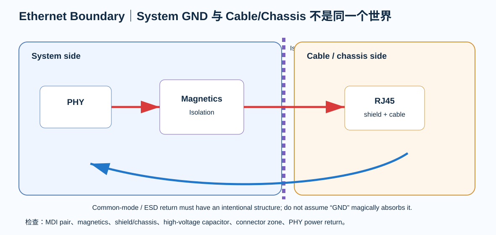

# 07｜Magnetics、RJ45、Shield 与 ESD：Ethernet 的板边边界

> PHY 能 link 不代表 Ethernet boundary 设计正确。真正出 EMC / ESD 问题的地方，经常就在 magnetics 与 connector 周围。

  

---

# 1. 先画隔离边界

~~~text
System Ground side
STM32 → PHY → MDI → Magnetics
                     ║ isolation
Cable / Chassis side ║
                  RJ45 → cable
~~~

这条边界决定：

- common-mode current 去哪里；
- ESD 从哪里进入；
- shield 接哪里；
- Bob Smith termination 参考哪里。

---

# 2. Magnetics 不是“一个黑盒变压器”

需要核对：

- 10/100BASE-TX compatible；
- turns ratio；
- center tap requirement；
- isolation voltage；
- insertion loss；
- package / pinout；
- common-mode choke 是否集成；
- PHY 推荐连接。

如果用 integrated MagJack，也要把内部 magnetics schematic 读懂。

---

# 3. MDI differential routing

PHY 到 magnetics：

- 100 Ω differential geometry 按 stackup/field solver 冻结；
- pair 内对称；
- 少 via；
- 不跨 reference discontinuity；
- 远离 SDCLK / buck SW；
- 不在 pair 中间塞 test point stub。

这里的“100 Ω”来自 Ethernet MDI channel，不等于 RMII 也要 100 Ω。

---

# 4. Cable-side termination

LAN8742A datasheet 的 twisted-pair interface diagram给出了 cable-side termination / high-voltage capacitor 的参考结构。

V3 的原则：

> 先按 PHY datasheet / magnetics datasheet 构建，再根据 enclosure/chassis 目标决定参考节点。

不要：

- 抄别家 PHY 的 Bob Smith 数值；
- 随便把高压电容接数字地；
- 把 shield 和 system GND 画成同一个 net 后停止思考。

---

# 5. Shield

RJ45 shield 的处理与产品结构有关：

- plastic enclosure
- metal enclosure
- PE/chassis
- isolated floating product
- ESD target

所以本教材不写：

> “RJ45 shield 必须 1 nF 接 GND。”

真正要画的是：

~~~text
Cable shield
→ connector shell
→ chassis/structure
→ system reference
~~~

然后定义耦合路径。

---

# 6. ESD

Ethernet cable 是外部世界。

ESD 进入时，要问：

1. strike 在 shell 还是 signal pin？
2. magnetics 提供什么 isolation？
3. secondary/common-mode energy 从哪泄放？
4. PHY ground bounce 会不会进 MCU？
5. RJ45 与 system ground 的电容耦合有多大？

不能只看：

> “放了 TVS，所以安全。”

---

# 7. Connector zone

定义 board edge zone：

- RJ45
- magnetics
- shield/chassis
- ESD parts
- high-voltage capacitor
- keepout
- stitching / chassis vias
- no SDRAM tuning

让外部瞬态和内部 memory bus 在 floorplan 上物理分离。

---

# 8. PHY supply 与 magnetics supply

LAN8742A single-supply reference diagram里，PHY analog rail 与 magnetics bias network 有明确关系。

V3 要记录：

- ferrite 是否使用；
- 3V3_PHY branch；
- center tap feed；
- local bypass；
- return path。

不要直接把 3V3 大 plane 拉到 connector 边缘，再声称“铜越大越好”。

---

# 9. Ethernet Boundary Lab

打开：

[Ethernet Boundary Lab](../interactive/ethernet-boundary-lab.html)

切换：

- shield directly coupled
- capacitive chassis path
- poor system-GND return
- noisy PHY supply

观察教学性的 common-mode / discharge risk。

---

# 10. Review

- [ ] PHY↔magnetics pair 清晰
- [ ] cable side / system side 边界清楚
- [ ] shield 有结构定义
- [ ] termination 按 PHY/magnetics datasheet
- [ ] no test stub on MDI
- [ ] connector zone 不穿 SDRAM bus
- [ ] high-voltage capacitor rating/source 已记录
- [ ] PHY supply return 可解释
- [ ] ESD path 不只是一颗 TVS 符号

---

## 本章产出

**ethernet-interface-review.md**
