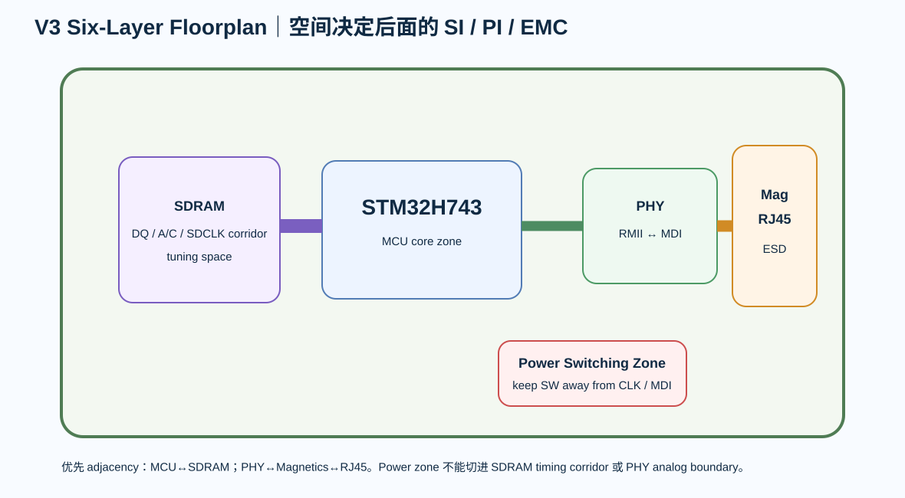

# 08｜六层 Floorplan 与布线顺序：先决定空间，再决定线

> Part 7 的 floorplan 是第一次真正同时面对 parallel bus、PHY、connector、power 和 analog boundary。

  

---

# 1. 先画 Block，不放 footprint

V3 至少分：

- MCU core zone
- SDRAM zone
- Ethernet PHY zone
- RJ45/magnetics zone
- power zone
- USB/debug zone
- expansion/slow I/O

先画相互关系，再开始真实 placement。

---

# 2. 两条最重要的 adjacency

## MCU ↔ SDRAM

目标：

- 极短；
- 低交叉；
- bus corridor 清晰；
- SDCLK direct。

## PHY ↔ Magnetics ↔ RJ45

目标：

- MDI pair 短；
- connector boundary 清晰；
- cable common-mode 不穿 MCU/SDRAM zone。

---

# 3. Power zone 不要插进两条高速链

Buck / switching power 应尽量：

- 离 SDRAM timing corridor 远；
- 离 PHY analog MDI 远；
- SW node 不朝向 RJ45 / SDCLK；
- 但又不能离 load 太远导致 3V3 distribution 很差。

这就是 floorplan tradeoff。

---

# 4. 推荐 Routing Priority

V3 不按“先最难看起来的线”走。

顺序：

1. power/ground infrastructure
2. HSE / VCAP / sensitive local loops
3. FMC_SDCLK
4. SDRAM DQ
5. SDRAM address/command
6. RMII REF_CLK
7. RMII data/control
8. PHY MDI pairs
9. USB
10. SWD
11. slow GPIO

---

# 5. 为什么 MDI pair 不是第一个

因为它本身只有两对，很容易单独走漂亮。

真正影响全板 topology 的，是 SDRAM 的几十根并行线。

先把小接口走完，可能会把 SDRAM corridor 切碎。

---

# 6. Layer Role

延续 Part 6 的原则：

> Layer name 不等于 reference。

V3 冻结前，针对每类 net 输出：

| Net group | Preferred layer | Reference | Via budget |
|---|---|---|---|
| SDCLK | TBD | solid GND | minimal |
| SDRAM DQ | TBD | solid plane | low |
| SDRAM A/C | TBD | solid plane | low |
| RMII | outer/inner TBD | solid GND | low |
| MDI | controlled layer | solid reference | minimal |
| USB | controlled layer | GND | low |

具体 L1/L3/L4/L6 要结合 Part 6 的真实 stackup adjacency。

---

# 7. Power Plane Split Review

多 rail 不代表把一个 internal plane 切成拼图后就结束。

每一个 split 要叠加：

- SDRAM bus；
- RMII；
- USB；
- clock；
- debug。

任何 high-speed net 跨 split，都要解释 return path。

---

# 8. Tuning zone

预留专门的 tuning corridor。

不允许：

- 在 MCU BGA escape 区补蛇形（本项目是 LQFP，但原则相同）；
- 在 RJ45 ESD zone 补 SDRAM；
- 在 power SW node 附近补 clock；
- 在 plane gap 上补 length。

---

# 9. 组件朝向

SDRAM TSOP orientation 要看：

- MCU FMC pin sides；
- DQ pin distribution；
- address/control side；
- power pin；
- SDCLK entry。

PHY orientation 看：

- RMII side toward MCU；
- MDI side toward magnetics；
- crystal 和 RBIAS 有局部空间。

---

# 10. Placement Freeze Gate

进入 routing 前必须通过：

- [ ] MCU/SDRAM adjacency
- [ ] SDCLK direct path
- [ ] DQ corridor
- [ ] PHY/magnetics/RJ45 chain
- [ ] power hot loop
- [ ] VCAP/VDDA placement
- [ ] connector ESD zone
- [ ] no unavoidable reference split crossing
- [ ] testpoint access
- [ ] assembly orientation

---

# 11. 本章任务

填写 **floorplan-plan.md** 和 **routing-rule-matrix.md**。

并保存：

- block screenshot
- placement screenshot
- critical corridor annotation
- layer/reference map

---

# 12. Fault Lab

- 为了 RJ45 在板边好看，把 PHY 推到 MCU 旁边、MDI 绕半块板；
- SDRAM 放得很近，但方向反了导致 DQ 大量交叉；
- Buck 在 SDCLK 和 PHY 中间；
- 先走 USB，最后 SDRAM 只能换三次层；
- PWR split 直接切过 Address group；
- tuning zone 没预留，最后到处塞蛇形。
