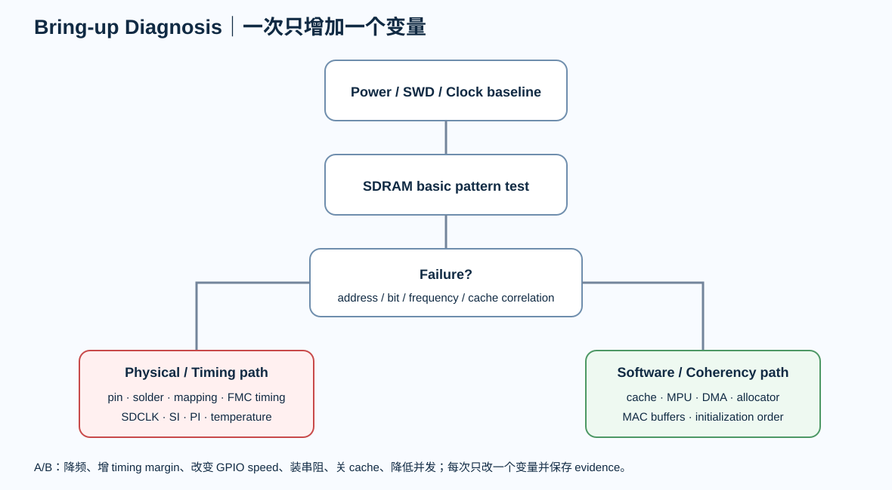

# 11｜Bring-up：把“板子不稳定”拆成可验证假设

> 高速板 Bring-up 最怕一句话：“SDRAM 好像不稳定。”工程调试必须把现象拆成假设、测试和证据。

  

---

# 1. 不同时开所有功能

~~~text
Power only
→ MCU/SWD
→ clocks
→ internal RAM baseline
→ SDRAM basic
→ SDRAM full-range
→ cache/MPU
→ DMA stress
→ PHY ID/MDIO
→ RMII link
→ packet stress
→ SDRAM + Ethernet concurrent stress
~~~

每一步只新增一个主要变量。

---

# 2. SDRAM Bring-up

第一阶段关闭或简化 cache、DMA、Ethernet。

测试顺序：

1. 固定地址写读
2. walking 1/0
3. 0xAAAAAAAA / 0x55555555
4. address-as-data
5. pseudo-random
6. full-range
7. long-duration loop

记录失败地址与 bit pattern。

---

# 3. 失败模式

## 某一 bit 总错

先看 DQ mapping、solder、short/open。

## 某一地址范围错

先看 address/bank line、row/column config、memory size。

## 高频/高温才错

提高 timing/SI/PI/clock/refresh 的怀疑权重。

## 只在 cache/DMA 开启后错

先查 cache coherency、MPU 与 DMA buffer ownership，不立即改 PCB。

---

# 4. Timing A/B

如果 100 MHz 不稳定：

- 降 SDCLK
- 增 timing margin
- 改 GPIO speed
- 装/改 SDCLK series resistor
- 关 cache
- 降并发

每次只改一个变量。

降频后明显改善说明 timing/SI/PI 假设权重上升，但仍不是“PCB 一定坏”的最终证据。

---

# 5. 测量

优先测：

- SDCLK
- RMII_REF_CLK
- 3V3_SDRAM
- SDRAM local VDDQ
- 3V3_PHY
- reset

使用短 ground spring 与合适探头，不让测量方法制造假尖峰。

---

# 6. Ethernet Bring-up

1. PHY power
2. reset
3. crystal/clock
4. MDIO read PHY ID
5. straps
6. auto-negotiation
7. link
8. RMII traffic
9. ping
10. throughput
11. packet-loss stress

PHY ID 都读不到时，不先调 LwIP。

---

# 7. 故障分层

## PHY ID 读不到

看 MDIO/MDC、reset、address、power、clock。

## PHY ID 正常但不 link

看 MDI、magnetics、RJ45、cable、straps、analog supply、pair mapping。

## link 正常但 packet error

看 RMII timing、MAC config、cache/DMA、software buffer、EMI/PI。

---

# 8. 最有价值的压力测试

最终运行：

> Ethernet 持续大流量 + SDRAM buffer + CPU load + GPIO switching。

它同时提高 memory traffic、DMA、I/O current、PDN stress 与 EMI activity。

---

# 9. Validation Matrix

| Test | Condition | Expected | Actual | Evidence |
|---|---|---|---|---|
| SDRAM pattern | 100 MHz | 0 errors | TBD | log |
| SDRAM long | hot/cold | 0 errors | TBD | log |
| RMII clock | 50 MHz | stable | TBD | scope |
| Ethernet ping | 1 h | no loss | TBD | log |
| throughput | full traffic | target | TBD | pcap |
| concurrent | ETH+SDRAM | stable | TBD | log |
| rail noise | max load | within target | TBD | scope |

本章产出 bringup-test-plan.md 和 validation-matrix.md。
