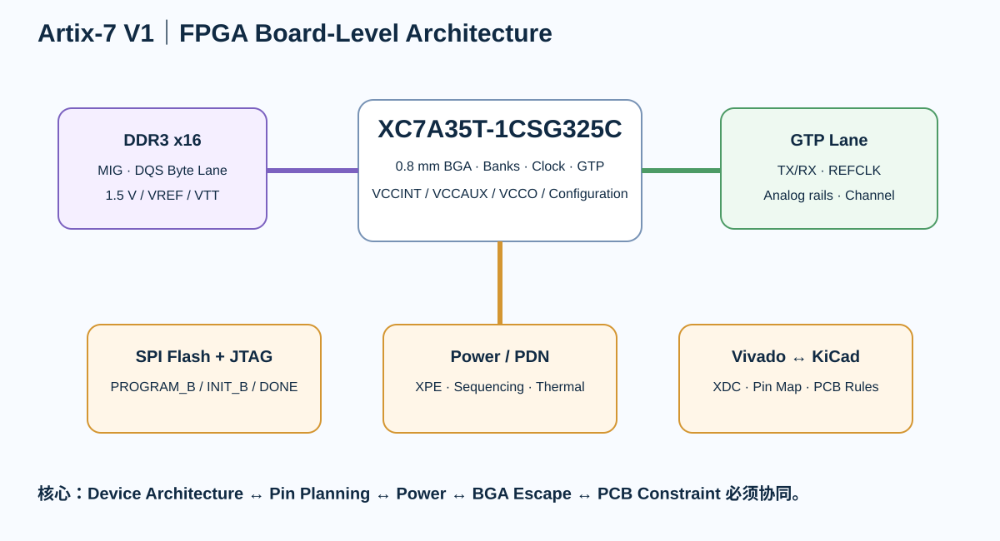

# Part 8｜FPGA 板级设计专项：从 Bank、电源、BGA 到 DDR3 与高速差分

> 🎮 **真正动手请进入 [Artix-7 START HERE](../projects/artix7-mainline/v1/START_HERE.md)**。不要从 DDR3/GTP 中间切入；按 Device/Package → Bank → Power → BGA → DDR3 → GTP 顺序过 Gate。

> 这一 Part 只讲 **FPGA board-level engineering**。不会把课程变成 Verilog / VHDL 教程。

---

# 教学主角

**AMD Artix-7 XC7A35T-1CSG325C**

选择理由：

- 15 mm × 15 mm、0.8 mm pitch CSG325 BGA，足以练真正的 BGA escape；
- 有足够 HR I/O Bank，适合讲 VCCO / IOSTANDARD；
- CSG325 封装可引出 GTP，能把普通 SelectIO 与高速 SerDes 分开；
- 7 Series 的 PCB / Configuration / SelectIO / Memory Interface 官方资料链完整。

DDR3 教学器件：

**Alliance AS4C64M16D3B-12BIN**

- 1 Gbit；
- 64M × 16；
- 1.5 V DDR3；
- 96-ball FBGA；
- Industrial；
- 作为 MIG / DDR3 board-level 教学器件。

---

# 这一 Part 的核心问题

MCU 板通常先问：

> 这个 pin 是什么外设？

FPGA 板首先要问：

> 这个 pin 属于哪个 Bank？Bank 电压是多少？它是不是 DQS / MRCC / SRCC / GTP / configuration pin？这个 pin assignment 能不能被 PCB 布出来？

因此 FPGA PCB 是真正的：

> **Device Architecture ↔ Pin Planning ↔ Power ↔ PCB Floorplan ↔ Constraints Co-design**

---

# 学习路线

~~~text
FPGA Device / Package Freeze
→ Bank / IOSTANDARD / Pin Planning
→ Power Rails / Sequencing / XPE
→ Configuration / JTAG / SPI Flash
→ Clock Inputs / Clock-capable Pins
→ BGA Fanout / Escape / Stackup
→ DDR3 + MIG / DQS Byte Lane
→ GTP / High-Speed Differential
→ Vivado XDC ↔ KiCad Net/Rule Matrix
→ PDN / Decoupling / Thermal
→ Bring-up / Configuration / Memory / SerDes
→ Final Board Review
~~~

---

# 三类 I/O 必须分开

## 普通 SelectIO

- LVCMOS
- LVDS
- SSTL
- HSTL
- clock-capable I/O

受 Bank VCCO / IOSTANDARD / pin type 约束。

## Memory Interface

DDR3 不只是“一组普通 I/O”。

MIG 会约束：

- DQS byte group；
- DQ / DM membership；
- CK；
- address/control；
- bank selection；
- VREF / DCI；
- clocking。

## GTP Transceiver

GTP 不是普通 differential pair。

它有独立：

- MGTAVCC
- MGTAVTT
- reference clock
- TX/RX lanes
- AC coupling / termination requirements
- channel loss / return-loss concerns

---

# 本 Part 的互动实验

- [Bank Voltage Lab](../interactive/fpga-bank-voltage-lab.html)
- [BGA Escape Lab](../interactive/fpga-bga-escape-lab.html)
- [DDR3 Byte-Lane Lab](../interactive/fpga-ddr3-byte-lane-lab.html)

---

# 项目资产

放在：

**projects/artix7-mainline/v1/**

包括：

- system-spec.md
- package-bank-map.md
- io-standard-matrix.md
- power-rail-budget.md
- configuration-plan.md
- clock-plan.md
- bga-escape-plan.md
- ddr3-mig-plan.md
- ddr3-routing-review.md
- gtp-interface-plan.md
- vivado-kicad-constraint-map.md
- pdn-review.md
- bringup-test-plan.md
- validation-matrix.md
- release-gate.md
- source-freeze.md

---

# 通过标准

学完以后，你应该能解释：

1. 为什么这根 GPIO 不能随便挪到另一个 Bank？
2. 为什么同一个 Bank 里的 I/O standard 会互相制约？
3. 为什么 DDR3 pinout 应由 MIG / device rules 驱动，而不是 PCB 最后再“找顺手的 pin”？
4. 为什么 VCCINT、VCCAUX、VCCBRAM、VCCO 不能合并成“FPGA 电源”？
5. 为什么 GTP 不能照普通 LVDS 规则画？
6. 为什么 BGA escape 决定 layer count？
7. 为什么 FPGA pin planning 与 PCB placement 必须迭代？
8. 为什么“Vivado DRC 通过”和“PCB DRC 通过”都不足以证明硬件可用？

---

## 一手资料基线

- AMD DS181 Artix-7 DC/AC Data Sheet
- AMD UG475 7 Series Packaging and Pinout
- AMD UG471 7 Series SelectIO
- AMD UG472 7 Series Clocking
- AMD UG470 7 Series Configuration
- AMD UG483 7 Series PCB Design Guide
- AMD UG586 7 Series Memory Interface Solutions
- AMD UG482 7 Series GTP Transceivers
- AMD UG1099 BGA Device Design Rules and Strategies
- Alliance AS4C64M16D3B DDR3 product/datasheet
- KiCad 10 PCB Editor documentation

实际生产冻结前重新核对 revision、器件 lifecycle、Flash/DDR3 exact suffix、板厂 stackup 与 Vivado 版本。
