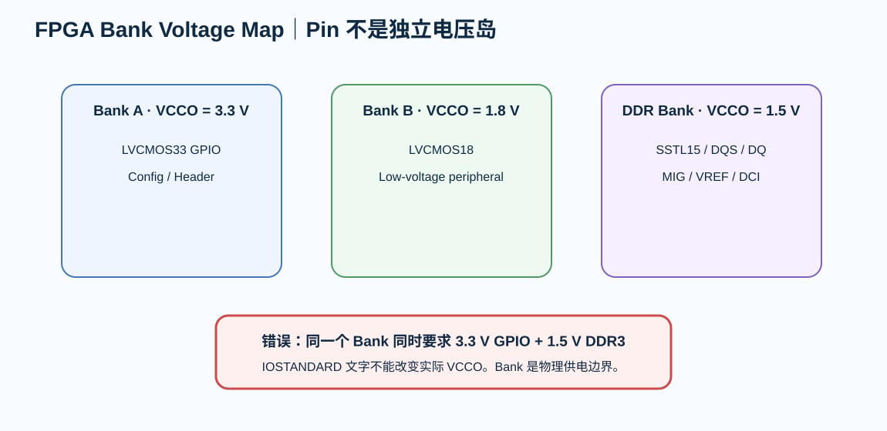

# 02｜Bank、VCCO 与 IOSTANDARD：FPGA Pin Planning 的第一原则

> FPGA 的 I/O pin 不是一堆可互换 GPIO。它们属于 Bank，而 Bank 由 VCCO、VREF、pin type 和 dedicated resources 共同约束。

---

# 1. 先从 Bank 看 pin

每个 user I/O 至少要记录：

- package ball；
- Bank number；
- pin type；
- IOSTANDARD；
- VCCO；
- direction；
- clock capable?；
- differential pair mate?；
- memory byte group?；
- VREF/DCI involvement?。

---

# 2. VCCO 是 Bank 级约束

如果 Bank A 被供成 3.3 V：

你不能再在这个 Bank 里随便放一个要求 1.5 V VCCO 的 DDR3 SSTL15 接口。

这不是“软件提醒”。

而是：

> **同一个 Bank 的物理供电节点已经被固定。**

---

# 3. V3 教学 Bank 规划

项目级概念规划：

| Bank Role | VCCO | Typical Use |
|---|---:|---|
| CONFIG / general | 3.3 V | SPI/JTAG/LED/control |
| GPIO bank | 3.3 V | headers / slow I/O |
| LOW-VOLT bank | 1.8 V | 1.8 V peripheral experiment |
| DDR3 bank(s) | 1.5 V | SSTL15 / DQS / DQ |

最终 exact Bank number 必须由：

- CSG325 package pinout；
- MIG bank rules；
- Vivado pin planner

共同冻结。

---

# 4. IOSTANDARD 不是 HDL 属性装饰

它影响：

- input thresholds；
- output drive；
- slew；
- termination；
- VCCO；
- VREF；
- differential behavior。

因此 schematic 的 connector voltage 与 XDC 的 IOSTANDARD 必须一致。

---

# 5. Configuration Bank

7 Series configuration Bank 0 的电压还与：

- VCCO_0
- CFGBVS
- CONFIG_VOLTAGE

相关。

如果设计用 3.3 V configuration I/O，需要把 CFGBVS 和 Vivado properties 正确冻结。

不能只在 PCB 上把 Flash 接到 3.3 V，然后认为工具自然知道。

---

# 6. Pin swap 不是无限自由

可以考虑 swap 的情况：

- 同一逻辑功能允许；
- 同一 Bank；
- pin type 兼容；
- differential pair 保持；
- memory byte group 规则允许；
- clock-capable requirement 不破坏；
- Vivado / MIG 接受。

不能交换：

> 只因为 PCB 走线变漂亮。

---

# 7. Pin Planning ↔ PCB Co-design

推荐循环：

~~~text
logical interface
→ candidate bank
→ candidate pins
→ preliminary BGA escape
→ connector/DDR placement
→ check crossings
→ adjust legal pins
→ re-run Vivado/MIG
→ freeze
~~~

这是 FPGA 和 MCU PCB 最大的区别之一。

---

# 8. Bank Voltage Lab

打开：

[Bank Voltage Lab](../interactive/fpga-bank-voltage-lab.html)

尝试把：

- 3.3 V LVCMOS
- 1.8 V LVCMOS
- DDR3 SSTL15

塞进同一 Bank，观察为什么会产生硬件冲突。

---

# 9. Design Review

- [ ] 每个外部接口有 Bank owner
- [ ] 每个 Bank 有唯一 VCCO 方案
- [ ] IOSTANDARD 与 VCCO 匹配
- [ ] differential pair mate 保持
- [ ] clock 输入使用合适 clock-capable pin
- [ ] DDR3 由 MIG pin rules 驱动
- [ ] VREF/DCI requirements 已记录
- [ ] CFGBVS / VCCO_0 / CONFIG_VOLTAGE 一致
- [ ] pin swap 有工具验证
