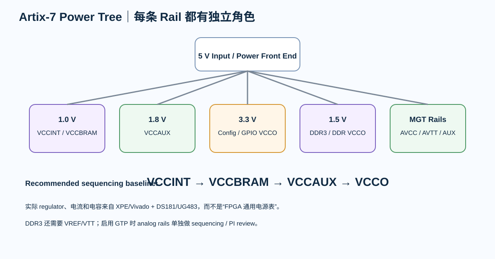

# 03｜FPGA 多电源 Rail：PDN、启动电流与 Sequencing

> FPGA 的“电源设计”不是给芯片接 1.0 V / 1.8 V / 3.3 V。真正问题是：每条 rail 为谁供电、需要多少动态电流、允许多少 ripple、怎样启动、怎样测量。

---

# 1. Artix-7 主要 Rail

对 XC7A35T，至少区分：

- VCCINT：core；
- VCCBRAM：Block RAM；
- VCCAUX：auxiliary；
- VCCO_x：每个 I/O Bank；
- VCCADC：XADC analog supply，如使用；
- MGTAVCC / MGTAVTT / MGTVCCAUX：GTP 相关 supply，如使用 GTP；
- VCCBATT：仅在特定密钥/功能使用时考虑。

项目不能把它们都叫“FPGA_PWR”。

---

# 2. 典型电压不是设计电流

7 Series Artix-7 标准器件典型：

- VCCINT ≈ 1.0 V；
- VCCBRAM ≈ 1.0 V；
- VCCAUX ≈ 1.8 V；
- VCCO 由 Bank IOSTANDARD 决定。

但 regulator 电流不能从“芯片最大功耗”拍脑袋。

要使用：

> **Xilinx Power Estimator / Vivado power estimate**

并输入：

- logic utilization；
- toggle rate；
- BRAM；
- clock；
- I/O 数量；
- IOSTANDARD；
- GTP；
- temperature。

---

# 3. UG483 的电容表不是 BOM 复制表

UG483 给出 PDN capacitor recommendations，并说明其假设来自：

- rail operating tolerance；
- regulator DC tolerance；
- allowable AC ripple；
- XPE current estimate；
- target impedance。

因此正确用法：

~~~text
device/package
+ power estimate
+ regulator model
+ capacitor model
+ mounting inductance
→ PDN target / validation
~~~

不是“照表焊几颗”。

---

# 4. Sequencing

DS181 推荐 power-on sequence：

~~~text
VCCINT
→ VCCBRAM
→ VCCAUX
→ VCCO
~~~

如果 VCCINT 与 VCCBRAM 使用相同电压，可设计为同源同时 ramp。

power-off 推荐反向。

使用 3.3 V HR Bank 时，还必须关注 VCCO 与 VCCAUX 的电压差/时间条件。

---

# 5. GTP 的电源是另一层系统

如果使用 GTP：

- MGTAVCC
- MGTAVTT
- MGTVCCAUX

需要单独的 noise / sequencing / decoupling review。

不要从 1.0 V core rail 随便分一根细线过去。

---

# 6. DDR3 电源

DDR3 还引入：

- 1.5 V VDD/VDDQ；
- VREFCA / VREFDQ；
- VTT / termination（取决于拓扑/实现）；
- memory local decoupling。

所以 FPGA 板 rail 数会快速增加。

---

# 7. Power Tree 先于完整原理图

建议先画：

~~~text
Input 5V
├─ 1.0V FPGA core / BRAM
├─ 1.8V VCCAUX
├─ 3.3V config / GPIO
├─ 1.5V DDR3 / DDR Bank
├─ DDR VTT/VREF
└─ GTP rails（if enabled）
~~~

然后再决定 regulator topology。

---

# 8. Power Good / Reset / Configuration

FPGA configuration 不应该发生在 rail 还没有稳定的时候。

需要把：

- regulator PGOOD；
- PROGRAM_B；
- INIT_B；
- DONE；
- Flash power；
- oscillator startup

放在同一启动时间线上审查。

---

# 9. 测试点

至少给：

- VCCINT
- VCCAUX
- VCCO_DDR
- VCCO_3V3
- DDR3 VREF/VTT
- MGT rails（如用）
- PROGRAM_B / INIT_B / DONE

保留可测点。

---

# 10. Review

- [ ] 每条 rail 有负载 owner
- [ ] XPE/Vivado power 输入有版本
- [ ] regulator thermal/current margin 已审
- [ ] decoupling 不是机械复制
- [ ] sequence 与 DS181 一致或有分析
- [ ] 3.3 V VCCO/VCCAUX 条件已审
- [ ] GTP rail 独立审
- [ ] DDR VTT/VREF 有明确 topology
- [ ] PGOOD/configuration 时序已定义
