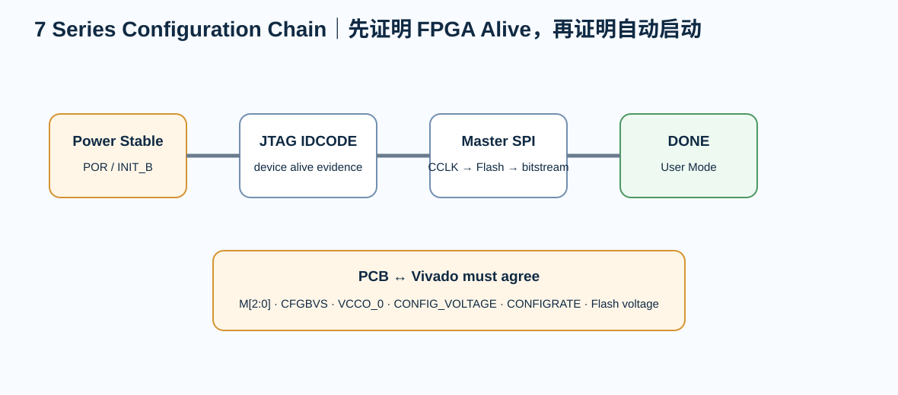

# 04｜Configuration、JTAG 与 SPI Flash：FPGA 为什么“上电不是程序就在那里”

> SRAM FPGA 上电后需要 configuration bitstream。配置电路因此是“启动系统”，不是附属下载口。

---

# 1. 最小配置观念

Artix-7 V1 同时保留：

- JTAG；
- Master SPI Flash。

JTAG 用于：

- IDCODE；
- debug；
- 临时配置；
- recovery。

SPI Flash 用于：

- 上电自动配置。

---

# 2. 关键 dedicated pins

至少审：

- PROGRAM_B
- INIT_B
- DONE
- M[2:0]
- CCLK
- CFGBVS
- JTAG TCK/TMS/TDI/TDO
- configuration data pins

这些 pin 在 configuration 阶段的角色不能只看 user-mode function。

---

# 3. Master SPI

UG470 定义 7 Series Master SPI mode。

基本链路：

~~~text
Power stable
→ FPGA POR
→ INIT_B ready
→ FPGA drives CCLK
→ SPI command/address
→ Flash sends bitstream
→ CRC/configuration
→ DONE
→ User mode
~~~

---

# 4. Flash 容量

不要只问：

> bitstream 大概几 MB？

需要记录：

- device configuration bitstream size；
- compression；
- fallback image；
- multiboot 是否使用；
- flash address map；
- programming method；
- configuration rate。

Flash exact part 在 release 前冻结。

---

# 5. CCLK / JTAG TCK 是高速边沿

XAPP586 特别提醒：

- CCLK；
- JTAG TCK

需要良好 signal integrity。

不要因为 nominal frequency 不高就允许：

- 超长 stub；
- 排针线缆；
- 多个探针 branch；
- reference gap。

---

# 6. CFGBVS

如果 configuration bank 使用 2.5/3.3 V：

- CFGBVS 需要相应设置；
- Vivado 中 CONFIG_VOLTAGE / CFGBVS properties 必须同步。

这是 PCB 与工具约束必须一致的经典例子。

---

# 7. DONE / INIT_B 不只是 LED

Bring-up 时它们是重要状态证据：

- INIT_B 不释放：看 power/configuration initialization；
- DONE 不拉高：看 bitstream transfer / CRC / mode；
- JTAG IDCODE 正常但 SPI 不启动：看 mode pins / flash / CCLK / voltage。

---

# 8. Flash 与用户逻辑共享

如果配置结束后 user design 还要访问 Flash：

必须明确：

- FCS_B ownership；
- SPI pin state；
- startup primitive / user access；
- bus contention；
- external pull。

不能只靠“配置完成后应该会自动让出来”。

---

# 9. Review

- [ ] M[2:0] 模式冻结
- [ ] CFGBVS / VCCO_0 / CONFIG_VOLTAGE 一致
- [ ] JTAG connector pinout 已核
- [ ] TCK route 可控
- [ ] SPI Flash voltage compatible
- [ ] CCLK route 可控
- [ ] PROGRAM_B / INIT_B / DONE 可测
- [ ] Flash capacity/source 冻结
- [ ] fallback/recovery strategy 已定义
