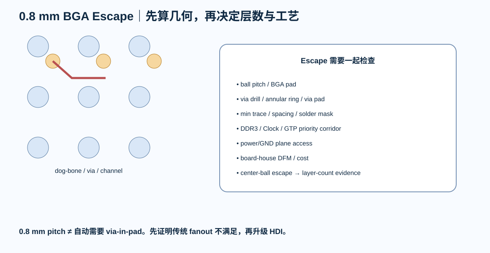

# 06｜BGA Fanout / Escape：层数不是接口数决定，而是逃线结构决定

> XC7A35T CSG325 是 0.8 mm pitch、18×18 ball grid。第一次做 FPGA BGA，重点不是“能不能拉一根线出去”，而是能否建立可制造、可复现、reference 连续的 escape strategy。

---

# 1. 先分 Ball 类型

BGA 不应该“全部一样 fanout”。

优先标记：

- GND；
- VCCINT；
- VCCBRAM；
- VCCAUX；
- VCCO_x；
- DDR3 DQS/DQ/CK；
- MRCC/SRCC；
- GTP TX/RX；
- GTP REFCLK；
- configuration/JTAG；
- general I/O。

这些球的 fanout priority 不一样。

---

# 2. 0.8 mm Pitch 不是自动等于 Via-in-Pad

0.8 mm BGA 常见实现选项包括：

- dog-bone fanout + through via；
- smaller through via；
- blind/buried microvia；
- via-in-pad。

选择取决于：

- board house annular ring / drill；
- trace/space；
- pad diameter；
- layer count；
- escape channel；
- cost；
- assembly yield。

本课程第一目标是：

> 在真实板厂 capability 下，尽量用可制造且不必要升级工艺的方案。

不会先默认“高速 FPGA 就必须 HDI”。

---

# 3. Escape Channel 先算，不先画

对 0.8 mm pitch，需要检查：

~~~text
ball pitch
- pad diameter
- via pad / annular ring
- solder mask rule
- min trace/space
= 可用 escape channel
~~~

如果两颗 via 之间只能过 0 条线，就不要靠缩线宽“硬挤”。

---

# 4. BGA 中心区域

越靠中心的 ball：

- through-via dog-bone 越可能需要更多 routing layers；
- power/GND ball 越密；
- reference transition 越多。

所以 layer count 应来自：

> **ball map + fanout topology + routing corridor**

而不是“FPGA 一般 6 层”。

---

# 5. Power / GND Escape

电源球的目标不是“每个 ball 一颗 via”这种机械规则。

要看：

- current distribution；
- via inductance；
- local plane access；
- plane spreading；
- PDN impedance。

GND via 同时服务：

- DC return；
- high-frequency return；
- shielding；
- BGA breakout reference。

---

# 6. DDR3 Ball Priority

如果 DDR3 使用某几个 HR Bank：

这些 bank 的：

- DQS；
- DQ；
- DM；
- CK；
- Address/Control

必须在 BGA escape 阶段预留干净 corridor。

不要让通用 GPIO 抢掉它们的内层通道。

---

# 7. GTP Ball Priority

GTP：

- TXP/N；
- RXP/N；
- REFCLKP/N；
- MGT power

优先级高于普通 GPIO。

它们要求：

- pair symmetry；
- minimal discontinuity；
- clean reference / return；
- GTP power integrity。

---

# 8. Fanout Direction

推荐先定义四类方向：

- DDR3 向 memory side；
- GTP 向 connector edge；
- configuration/JTAG 向 debug side；
- general I/O 向 headers。

如果 pin planning 和 PCB floorplan 是反方向，应该回到 Vivado 改合法 pin，而不是在 PCB 上绕整圈。

---

# 9. BGA Escape Lab

打开：

[BGA Escape Lab](../interactive/fpga-bga-escape-lab.html)

调整：

- ball pitch；
- pad；
- via pad；
- min trace；
- min spacing。

观察某个通道到底能不能实际通过。

它只是几何教学模型，最终以板厂规则和 footprint source 为准。

---

# 10. Review

- [ ] BGA pitch/package source 已记录
- [ ] board-house via/trace capability 已冻结
- [ ] 不无脑采用 via-in-pad
- [ ] DDR/GTP/clock priority 标记
- [ ] power/GND via strategy 有 PDN 理由
- [ ] 内层 escape corridor 预留
- [ ] layer count 有 fanout 证据
- [ ] 所有 footprint pad/via 满足 DFM
