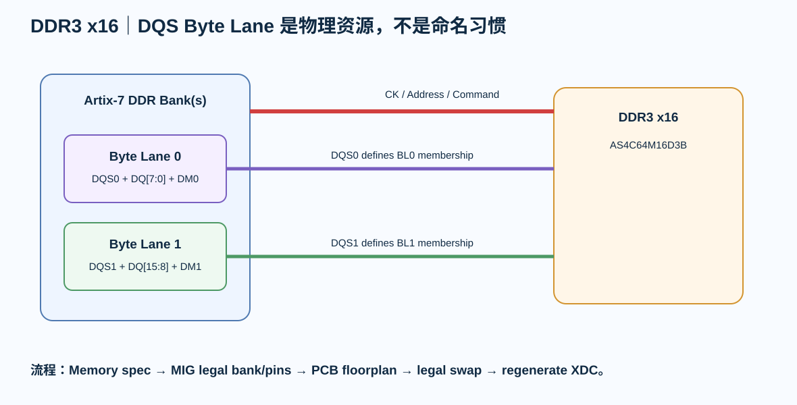

# 07｜DDR3 + MIG：Byte Lane、DQS 与 Pin Planning

> DDR3 不应该由 PCB 工程师先“挑好看 pin”，再要求 FPGA 工具接受。7 Series 的 DDR3 物理接口必须从 MIG / device byte-group rules 出发。

---

# 1. 教学器件

V1 DDR3：

**Alliance AS4C64M16D3B-12BIN**

- 1 Gbit；
- 64M × 16；
- 1.5 V；
- 96-ball FBGA；
- x16 data；
- 作为单颗 x16 DDR3 教学器件。

---

# 2. DDR3 的关键分组

## Byte Lane 0

- DQ[7:0]
- DQS0_P/N
- DM0

## Byte Lane 1

- DQ[15:8]
- DQS1_P/N
- DM1

## Address / Command

- A[]
- BA[]
- RAS/CAS/WE
- CKE
- CS
- ODT
- RESET（视器件/接口）

## Clock

- CK_P/N

---

# 3. 为什么 DQS 不能随便放

UG586 对 7 Series DDR3 pin selection 有明确 physical-layer rules。

DQS 必须使用指定 DQS pair。

DQ/DM 必须属于与对应 DQS 关联的 byte group。

所以这不是：

> “8 根 DQ 随便找 8 个同 Bank pin。”

而是：

> **DQS byte group 是硬件资源结构。**

---

# 4. MIG 是 Pin Planning 输入

正确流程：

~~~text
memory part / width / speed
→ choose candidate banks
→ MIG generates legal pin assignment
→ inspect byte lanes / clock / VREF / DCI
→ compare with PCB floorplan
→ adjust only within MIG-legal options
→ regenerate / validate
→ freeze XDC
~~~

---

# 5. DDR3 Bank Voltage

DDR3 SSTL15 需要对应 1.5 V Bank VCCO。

同一 Bank 不应再混入：

- 3.3 V header；
- 1.8 V peripheral；

除非 IOSTANDARD/VCCO 架构明确允许。

---

# 6. VREF / DCI

DDR3 Bank 可能涉及：

- VREF；
- VRP / VRN；
- DCI；
- VCCAUX_IO group constraints（具体器件/bank）。

这些专用资源在 package pin map 中不能忽略。

MIG/Vivado 的 DRC 是设计入口之一。

---

# 7. PCB Routing Groups

DDR3 不是“所有线统一等长”。

至少分：

- CK；
- DQS0 + DQ[7:0] + DM0；
- DQS1 + DQ[15:8] + DM1；
- Address/Command。

训练重点：

> **DQS ↔ DQ byte-lane relationship**

而不是把 MCU SDR SDRAM 的共同 clock 模型直接复制过来。

---

# 8. Fly-by / Topology

DDR3 的 Address/Command/Clock topology 要按：

- MIG generated design；
- selected memory topology；
- memory count/rank；
- board implementation

冻结。

不写成“DDR3 永远 fly-by”。

单颗 x16 和多颗多 rank 的 topology 压力并不相同。

---

# 9. Termination

DDR3 会涉及：

- ODT；
- series termination；
- VTT termination；
- VREF。

哪些需要外部器件、放哪里、数值多少，都应来自 MIG/reference design/memory datasheet。

不能从上一块 SDR SDRAM 的“预留 33 Ω”直接迁移。

---

# 10. DDR3 Byte-Lane Lab

打开：

[DDR3 Byte-Lane Lab](../interactive/fpga-ddr3-byte-lane-lab.html)

把 DQ 从一个 byte lane “拖”到另一个 lane，观察为什么逻辑上可编号不代表物理层合法。

---

# 11. PCB ↔ MIG 迭代

如果 PCB 发现某个 pin crossing 极差：

正确动作：

1. 标记具体 crossing；
2. 回 MIG / Pin Planner；
3. 查看该 byte group 内合法 swap；
4. regenerate；
5. 更新 schematic/XDC；
6. 再回 PCB。

不是只在 KiCad 里改 net label。

---

# 12. Review

- [ ] exact DDR3 part 已冻结
- [ ] MIG version 已记录
- [ ] DQS pair 合法
- [ ] DQ/DM 属于正确 byte group
- [ ] CK pin 合法
- [ ] VCCO/VREF/DCI 已审
- [ ] address/control topology 有来源
- [ ] ODT/VTT/termination 有来源
- [ ] XDC 与 schematic pin map 一致
- [ ] PCB route group 与 MIG group 一致
