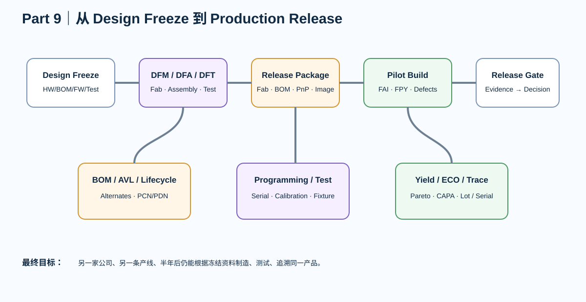

# Part 9｜工程交付与量产化：从“能工作”到“可制造、可测试、可追溯”

> 前 8 个 Part 解决“怎样把板设计对”。Part 9 解决另一个问题：**怎样让另一家公司、另一条产线、另一位工程师在半年后仍能制造、测试、复现和维护这块板。**

---

# 这一 Part 的真正对象

不是某一块 STM32 或 FPGA 板，而是三条主线共同的**工程发布系统**：

- STM32F407 V2：四层产品；
- STM32H743 V3：六层 MCU + SDRAM + Ethernet；
- Artix-7 V1：BGA + DDR3 + GTP。

它们最后都必须回答同一组问题：

> 工厂拿到什么文件？  
> 哪一个文件是 source of truth？  
> BOM 的替代料谁批准？  
> 首件怎样放行？  
> 坏板怎样记录？  
> 版本怎样追溯？  
> 什么时候可以叫“量产版”？

---

# 完整工程链

~~~text
Design Freeze
→ DFM / DFA / DFT
→ BOM / AVL / lifecycle
→ Fab + Assembly Data Package
→ Programming / Serialization
→ Test Strategy / Fixture
→ Pilot Build / FAI
→ Yield / Pareto / Root Cause
→ ECO / Revision / Traceability
→ Reliability / Pre-compliance
→ Supplier Release
→ Production Release Gate
~~~

---

# 这次会修掉的几个旧习惯

## “Gerber 发过去就行”

不够。

真实交付至少要管理：

- board source revision；
- Gerber / drill；
- stackup / impedance；
- fab drawing / notes；
- BOM；
- placement；
- assembly drawing；
- DNP/variant；
- programming image；
- test plan；
- source freeze；
- release manifest。

## “BOM 有料号就行”

不够。

量产 BOM 还要回答：

- Manufacturer Part Number；
- approved manufacturer/vendor；
- lifecycle；
- alternates；
- DNI/DNP；
- substitution equivalence；
- change approval；
- date code / lot / traceability（按产品要求）。

## “首件能工作就放量”

不够。

首件验证的是：

- 制造资料有没有歧义；
- 元件极性/方向；
- 工艺；
- 程序烧录；
- 测试流程；
- 关键尺寸；
- 功能；
- 可重复性。

---

# Standards Map

Part 9 不复制标准正文，只建立“什么时候该查哪类标准”的地图。

当前官方 IPC revision table 显示：

- IPC-A-600：Bare PCB acceptability，当前 Rev M（2025）；
- IPC-6012：Rigid PCB qualification/performance，当前 Rev F（2023）；
- IPC-A-610：Electronic assembly acceptability，Rev J（2024）；
- J-STD-001：Soldered assembly process/material requirements，Rev J（2024）；
- IPC-2581：智能制造数据交换，Rev C；
- IPC-1782：制造/供应链 traceability，Rev B（2023）。

**生产合同最终使用哪个 revision/class，必须由采购/质量/客户文件明确冻结。**

---

# KiCad 9 制造输出

KiCad 9 当前可生成：

- Gerber；
- Excellon / Gerber X2 drill；
- placement files；
- IPC-D-356；
- IPC-2581；
- ODB++；
- BOM（推荐从 schematic BOM 工具管理）。

因此课程会把：

> “输出文件”

升级成：

> **可验证的 Release Package。**

---

# 互动实验

- [Release Package Lab](../interactive/release-package-lab.html)
- [Yield Pareto Lab](../interactive/yield-pareto-lab.html)
- [ECO Impact Lab](../interactive/eco-impact-lab.html)

---

# 工程资产

放在：

**projects/production-release/**

包含：

- release-manifest.md
- design-freeze-record.md
- dfm-dfa-dft-review.md
- bom-avl-template.csv
- fabrication-notes.md
- assembly-notes.md
- programming-release.md
- test-strategy.md
- pilot-build-report.md
- yield-log.csv
- eco-template.md
- traceability-plan.md
- production-release-gate.md
- source-freeze.md

---

# Part 9 毕业标准

你应该能把一个已经工作过的 PCB 项目交给陌生 EMS，并让对方只通过冻结的资料包完成制造和测试；出现故障时，可以从 serial/lot/revision/test record 一路追到：

> **哪一版设计、哪一版 BOM、哪一批物料、哪一套程序、哪一份测试限值。**

这才叫工程交付。
