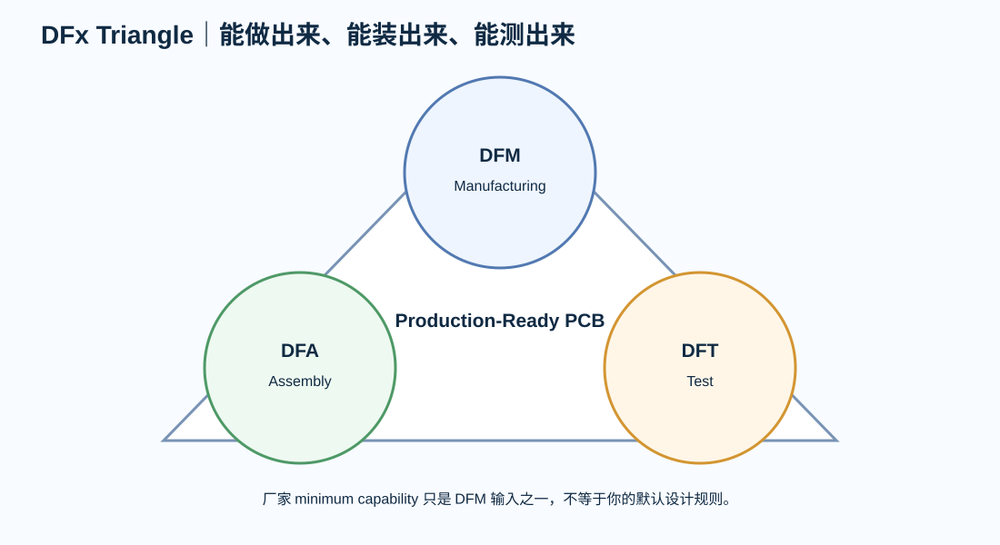

# 02｜DFM / DFA / DFT：不是“工厂最低能力 Checklist”

---

# 1. 三个不同问题

## DFM — Design for Manufacturability

PCB 能不能稳定做出来？

看：

- trace/space；
- drill / annular ring；
- aspect ratio；
- copper balance；
- solder mask；
- impedance；
- controlled depth / special process；
- panel/routing。

## DFA — Design for Assembly

元件能不能稳定贴、焊、检、返修？

看：

- land pattern；
- component spacing；
- orientation；
- stencil/paste；
- thermal mass；
- fiducial；
- board edge；
- BGA/QFN/BTC inspection；
- rework access。

## DFT — Design for Test

量产后怎样快速判断一块板 PASS/FAIL？

看：

- test access；
- programming；
- fixture；
- boundary scan / SWD / JTAG；
- rail measurement；
- functional stimuli；
- calibration；
- serial/traceability。

---

# 2. Manufacturer Capability ≠ Design Rule

例如当前 JLCPCB capability 页面列出多层板最低钻孔可到 0.15 mm、最小 via 约 0.15/0.25 mm，并给出孔径公差等能力。

这表示：

> **制造商声称可以做。**

它不表示：

> **你的全板默认就应该使用这个最小值。**

工程规则还要加：

- yield margin；
- cost；
- vendor portability；
- reliability；
- plating/aspect ratio；
- inspection。

---

# 3. IPC “Class” 不由工程师随口选择

课程里最常见的错误是：

> “工业产品就 Class 3。”

不能这样决定。

产品等级/acceptance criteria 应来自：

- customer contract；
- reliability requirement；
- regulatory/industry requirement；
- company quality plan；
- supplier agreement。

当前 IPC 体系中：

- IPC-6012 定义刚性板 qualification/performance；
- IPC-A-600 用于 bare board acceptability；
- J-STD-001 管焊接过程/材料要求；
- IPC-A-610 管组装后 acceptability。

它们不是一份标准解决所有问题。

---

# 4. Land Pattern 不再引用已停止维护的 IPC-7351B 作为唯一当前标准

IPC 当前 revision table 显示：

- IPC-7351 已 No Longer Maintained；
- IPC-7352 为当前 land pattern guideline。

所以旧教材里的：

> “按 IPC-7351B medium/low density 就行”

必须理解为某些制造商当前工艺条款，而不是 IPC 最新通用设计体系本身。

例如 JLCPCB 当前 assembly terms 仍会引用 IPC-7351B 的 medium/low density——这是**供应商自己的接单条件**。

---

# 5. DFA 数字必须有 Context

不要把下面写成全书通用值：

- “元件间距必须 0.8 mm”
- “热风返修必须 1.5 mm”
- “工艺边固定 5 mm”
- “QFN 必须 X-ray”
- “BGA 必须 via-in-pad”

正确流程：

~~~text
package
+ assembly process
+ machine/nozzle
+ inspection
+ rework strategy
+ supplier capability
= DFA rule
~~~

---

# 6. PCB Edge / Panel

板边问题取决于：

- conveyor；
- panel rail；
- V-cut / route tab；
- edge connector；
- overhanging component；
- depanelization stress。

JLCPCB 2026 的标准 PCBA 指南建议 edge rail 至少 5 mm，并规定 fiducial 结构/边缘 clearance。

教材只把它作为：

> **一个当前供应商案例。**

换 EMS 必须重核。

---

# 7. DFT 要在 Layout 前做

如果测试点最后才加：

- critical nets 已经没有位置；
- fixture probe access 不够；
- ground pin 太远；
- connector 被 enclosure 挡住；
- production programming 要拆壳。

所以 DFT Review 应至少两次：

1. Placement Freeze 前；
2. Production Release 前。

---

# 8. Design Review

- [ ] manufacturer capability source frozen
- [ ] project rule > capability minimum 有理由
- [ ] IPC/customer class requirement 由质量/合同定义
- [ ] land pattern source记录
- [ ] assembly spacing 与工艺匹配
- [ ] BGA/QFN inspection plan明确
- [ ] panel/depanelization考虑机械应力
- [ ] test access 在 layout 前审过
