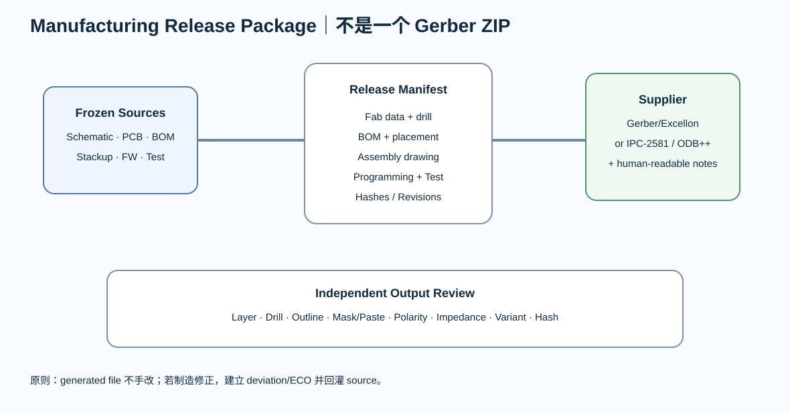

# 04｜制造资料包：Gerber 不是唯一真相

---

# 1. KiCad 9 当前输出能力

PCB Editor 当前支持：

- Gerber；
- Excellon drill；
- Gerber X2 drill；
- component placement；
- IPC-D-356；
- IPC-2581；
- ODB++；
- fabrication drawings / DXF/PDF 等。

因此工程师要理解：

> **格式只是传输方式，真正要保证的是数据完整性和版本一致性。**

---

# 2. Gerber + Drill

传统交付通常包括：

- copper layers；
- solder mask；
- silkscreen；
- board outline；
- drill；
- optional paste（钢网/装配）。

KiCad 官方说明 Gerber 仍是主要 PCB fabrication plotting format。

---

# 3. Drill 不要靠“厂家会猜”

必须定义：

- plated / non-plated；
- slot；
- finished size vs drill/tool intent；
- drill origin；
- units；
- special holes；
- press-fit / tolerance（如适用）。

建议附：

- drill map / drawing。

JLCPCB 当前也明确推荐 drill map，用于人工确认孔位置/属性/数量。

---

# 4. IPC-D-356

IPC-D-356 netlist 可用于：

- bare-board electrical test 数据交换；
- 与 artwork 进行 net connectivity cross-check。

它不是 schematic source 的替代品，但能让制造交付多一层电气一致性证据。

---

# 5. IPC-2581

当前 IPC-2581C 定义 XML-based intelligent manufacturing data，能携带：

- fabrication；
- assembly；
- BOM；
- stackup/data；
- manufacturing description。

KiCad 当前可导出 IPC-2581 B/C。

如果你的供应商支持：

> 它可以减少传统“Gerber + drill + PnP + BOM”文件之间的语义丢失。

但不要强行要求所有板厂都支持。

---

# 6. ODB++

KiCad 当前也支持 ODB++ 输出。

它同样可以携带完整 fabrication/assembly 数据。

工程策略：

- 与供应商确认其首选；
- 不把“新格式”自动等同于“更不会出错”；
- output 后仍要 Review。

---

# 7. Fab Drawing / Fabrication Notes

数据文件之外，还需要人读的要求。

至少记录：

- board revision；
- layer count；
- board thickness；
- material/Tg（若有要求）；
- copper；
- surface finish；
- solder mask；
- stackup ID；
- controlled impedance；
- board outline / critical dimensions；
- special via；
- tolerances；
- IPC/customer class；
- electrical test；
- marking/date/lot requirements。

---

# 8. Controlled Impedance

不要只在邮件里写：

> “USB 90 Ω。”

Release Package 应同时有：

- net/group；
- layer；
- target impedance；
- tolerance；
- stackup；
- trace geometry；
- coupon/report requirement；
- supplier responsibility boundary。

---

# 9. Output Verification

Release 前：

1. 用 GerbView / independent CAM viewer 打开 generated files；
2. layer-by-layer；
3. drill overlay；
4. board outline；
5. mask/paste；
6. polarity text；
7. dimensions；
8. stackup note；
9. checksum/hash。

不要用：

> “PCB Editor 里看起来对，所以 Gerber 一定对。”

---

# 10. “单一 ZIP”原则

推荐：

~~~text
release/
├── manifest
├── fab/
├── assembly/
├── bom/
├── programming/
├── test/
└── source-freeze/
~~~

制造商接收的是一个明确 revision 的 release package。

---

# 11. 本章任务

建立：

- fabrication-notes.md
- release-manifest.md

并选择一个项目模拟生成：

- Gerber；
- drill；
- placement；
- BOM；
- IPC-D-356。

如果供应商支持，再比较 IPC-2581 / ODB++。

---

# Review

- [ ] all outputs generated from frozen source
- [ ] drill map checked
- [ ] layer count checked
- [ ] board outline checked
- [ ] impedance table一致
- [ ] format matches supplier capability
- [ ] release package hash recorded
