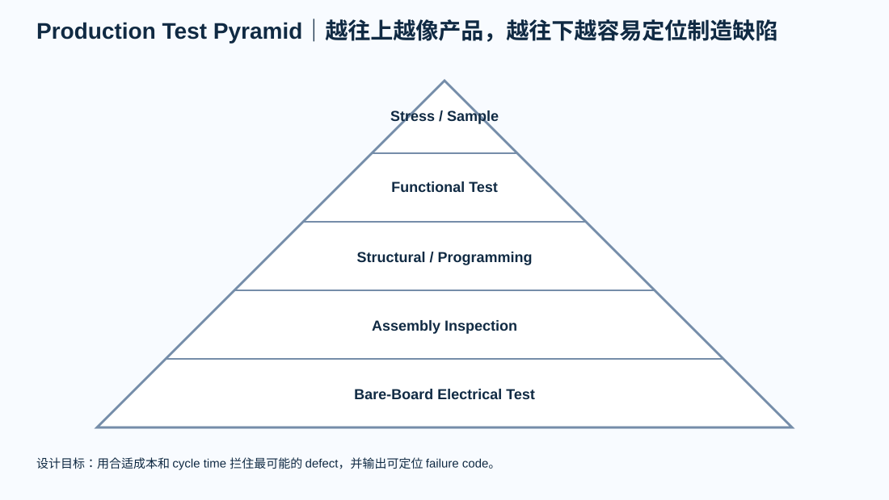

# 07｜DFT 与量产测试：测试不是“上电看 LED”

> 量产测试的目标不是证明设计理论正确，而是在有限测试时间里，尽可能高概率地拦截制造缺陷和配置错误。

---

# 1. Test Coverage 是工程权衡

三个变量：

- coverage；
- test time；
- fixture/equipment cost。

不能同时无限追求。

所以先问：

> 量产最可能出现什么 defect？

例如：

- solder open/short；
- wrong component；
- polarity；
- BGA/QFN hidden joint；
- power rail；
- oscillator；
- programming；
- connector；
- calibration。

---

# 2. Test Pyramid

从底到顶：

## Bare-board Test

制造商 electrical test / netlist。

## Assembly Inspection

- AOI；
- visual；
- X-ray（按风险）；
- solder/process。

## Structural Electrical Test

- resistance；
- rail；
- shorts；
- ICT / flying probe；
- boundary scan。

## Functional Test

- boot；
- interfaces；
- sensors；
- Ethernet；
- memory；
- FPGA；
- output/load。

## Stress / Sample Test

- thermal；
- long-run；
- EMC/pre-compliance；
- reliability。

---

# 3. ICT 不等于必须有

ICT 值得在：

- volume较高；
- testpoint覆盖好；
- fixture成本可摊销；
- manufacturing defect diagnosis重要

时使用。

低量产品可能：

> flying probe + programming fixture + FCT

更合理。

---

# 4. FCT 应测“产品功能”，但要能定位

糟糕 FCT：

> PASS / FAIL

更好的：

- rail fail；
- MCU ID fail；
- Flash fail；
- SDRAM fail；
- Ethernet PHY fail；
- Ethernet packet fail；
- sensor fail；
- current fail。

这样产线可以 Pareto，而不是每块 FAIL 都送研发。

---

# 5. Testpoint Design

测试点需要考虑：

- probe diameter；
- fixture tolerance；
- solder mask；
- pitch；
- access；
- bottom-only strategy；
- ground references；
- high-frequency probe loading。

不要给高速信号随便加 stub 只为了测试。

---

# 6. STM32F407 V2 示例

FCT：

- current；
- 3V3；
- SWD ID；
- Flash；
- USB enumeration；
- CAN loop；
- SDIO test；
- GPIO。

---

# 7. STM32H743 V3 示例

增加：

- SDRAM pattern；
- RMII REF_CLK；
- PHY ID；
- Ethernet link/packet；
- concurrent load。

---

# 8. Artix-7 示例

增加：

- rail sequencing；
- JTAG IDCODE；
- SPI boot；
- DDR3 MIG calibration；
- GTP diagnostic；
- Bank loopback。

---

# 9. Golden Fixture

fixture 自己也会坏。

所以定义：

- known-good board；
- fixture self-test；
- cable reference；
- probe replacement interval；
- calibration；
- software version。

否则：

> 夹具坏了会制造“整批产品都坏”的假象。

---

# 10. Test Limits

Limit 必须来自：

- design spec；
- datasheet；
- calibration；
- statistical process evidence；
- safety/regulatory。

不能为了提高 yield 随意放宽。

任何 limit change：

> 走 ECO / Test Revision。

---

# 11. 本章产出

填写：

- test-strategy.md
- fixture-requirements.md

Review：

- [ ] defect model明确
- [ ] coverage vs cycle time有目标
- [ ] testpoints在layout阶段冻结
- [ ] FCT故障码可定位
- [ ] fixture有self-test
- [ ] limit有source
- [ ] test revision受控
