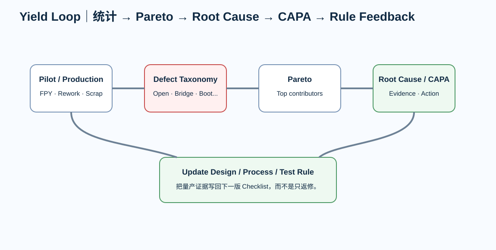

# 09｜Yield、Pareto 与 Root Cause：不要靠“返修师傅很厉害”维持量产

---

# 1. 三个数字先分开

## FPY

第一次通过率。

## Final Yield

经过允许返修后最终合格率。

## Scrap Rate

无法经济修复/不允许返修的报废比例。

把三个混成一个“良率”会失去工程信息。

---

# 2. Defect Taxonomy

至少分类：

- bare PCB；
- placement；
- solder；
- component；
- programming；
- test fixture；
- firmware/config；
- design；
- unknown。

进一步可以：

- open；
- bridge；
- insufficient solder；
- tombstone；
- polarity；
- wrong value；
- BGA joint；
- no boot；
- no link；
- memory error。

---

# 3. Pareto

目标不是画一张漂亮图。

目标：

> 找出少数最主要 defect，占用了多少返修/报废。

例如：

~~~text
U3 insufficient solder    35
C17 wrong orientation     18
SPI programming fail      12
other                      20
~~~

前两类可能已经足够值得单独改善。

---

# 4. Design vs Process

不要急着归责。

同一个 symptom：

> Ethernet link fail

可能来自：

- PHY solder；
- wrong magnetics；
- firmware；
- crystal；
- MDI layout；
- cable；
- fixture。

分类要基于 root cause evidence，而不是第一印象。

---

# 5. 5-Why 不是形式主义

一个例子：

**为什么 QFN 开路？**  
→ center pad 焊料不足。

为什么不足？  
→ paste transfer不稳定。

为什么？  
→ aperture/area ratio + stencil/process不合适。

为什么设计没发现？  
→ DFA Review没有 package-specific paste source。

为什么 Release 仍通过？  
→ checklist只检查“有钢网”。

真正纠正措施可能是：

- aperture；
- stencil；
- process；
- inspection；

而不是“让操作员更小心”。

---

# 6. CAPA / Corrective Action

每个 major defect：

- containment；
- root cause；
- corrective action；
- validation；
- recurrence prevention；
- owner；
- due date。

---

# 7. Design Rule Feedback

如果量产发现：

> 0.2 mm component gap 虽然供应商能贴，但返修困难、yield差。

就应把新经验升级成：

> 公司/项目 rule。

但要记录来源：

- build；
- sample size；
- defect；
- cost impact。

这比“师傅说 0.5 mm 好一点”更可靠。

---

# 8. Yield Pareto Lab

打开：

[Yield Pareto Lab](../interactive/yield-pareto-lab.html)

调整几个 defect count，观察：

- FPY；
- top defects；
- cumulative impact。

---

# 9. Review

- [ ] FPY/final/scrap分开
- [ ] defect taxonomy统一
- [ ] top defects有证据
- [ ] root cause不是症状
- [ ] containment与permanent fix分开
- [ ] corrective action有验证
- [ ] checklist/rule得到反馈
