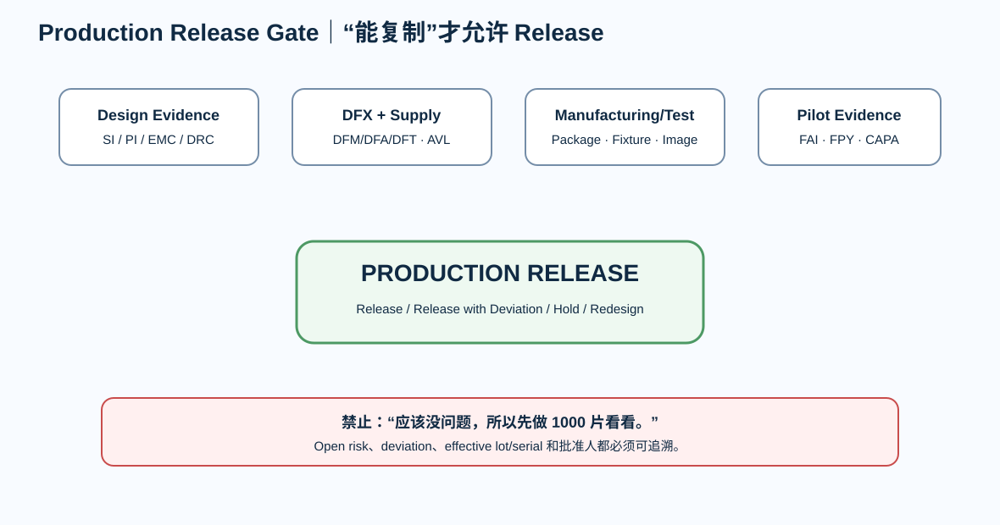

# 13｜Production Release Gate：从 PCB 学员到硬件工程闭环

> Production Release 是全书最后一个 Gate。它不是“技术负责人觉得差不多”，而是证据齐全后允许复制这个产品。

---

# 1. Product Definition

- [ ] requirements frozen
- [ ] HW revision
- [ ] BOM revision
- [ ] FW/FPGA image
- [ ] test revision
- [ ] variants

---

# 2. Design Evidence

- [ ] schematic review
- [ ] PCB DRC
- [ ] SI review
- [ ] PI review
- [ ] EMC review
- [ ] thermal
- [ ] stackup/impedance
- [ ] source freeze

---

# 3. DFX

- [ ] DFM
- [ ] DFA
- [ ] DFT
- [ ] panel
- [ ] stencil
- [ ] inspection
- [ ] test access
- [ ] service/rework

---

# 4. BOM / Supply

- [ ] exact MPN
- [ ] lifecycle
- [ ] AVL
- [ ] alternates validated
- [ ] long lead risks
- [ ] PCN/PDN process
- [ ] DNP/variant controlled

---

# 5. Manufacturing Data

- [ ] release manifest
- [ ] Gerber / intelligent data
- [ ] drill
- [ ] fab drawing
- [ ] stackup
- [ ] impedance
- [ ] assembly drawing
- [ ] BOM
- [ ] placement
- [ ] checksum/hash

---

# 6. Programming / Test

- [ ] production image
- [ ] programming procedure
- [ ] serial
- [ ] calibration
- [ ] fixture
- [ ] test coverage
- [ ] limits
- [ ] fixture self-test

---

# 7. Pilot

- [ ] FAI
- [ ] FPY
- [ ] final yield
- [ ] scrap
- [ ] rework
- [ ] Pareto
- [ ] CAPA
- [ ] pilot decision

---

# 8. Reliability / Compliance

- [ ] mission profile
- [ ] pre-compliance
- [ ] ESD/EFT/surge target
- [ ] thermal
- [ ] environmental
- [ ] margin
- [ ] open risk accepted

---

# 9. Traceability / Change

- [ ] serial/lot mapping
- [ ] ECO
- [ ] supplier notification
- [ ] revision marking
- [ ] RMA/failure feedback
- [ ] archive

---

# 10. 最终决策

只允许：

- **RELEASE**
- **RELEASE WITH DOCUMENTED DEVIATION**
- **HOLD**
- **REJECT / REDESIGN**

---

# 11. 全书毕业题

给你任意一块四层/六层/FPGA 板，你应该能完整回答：

> 需求是什么？  
> 电流怎么流？  
> reference/return 是什么？  
> stackup 为什么这样选？  
> impedance/timing 从哪来？  
> power rail 为什么这样设计？  
> connector/ESD 为什么这样处理？  
> PCB 怎么制造？  
> BOM 怎么替代？  
> 工厂拿到什么？  
> 怎样测试？  
> 怎样判断一批板稳定？  
> 出问题如何追到具体 revision/lot？  
> 怎样安全地改下一版？

这比“会背多少条 PCB 规则”更接近真实硬件工程。

---

# 12. 最终工程链

~~~text
Physics
→ Device Requirement
→ System Architecture
→ PCB Constraint
→ KiCad / Vivado
→ DRC + Manual Review
→ Manufacturing Data
→ Assembly
→ Programming
→ Test
→ Pilot / Yield
→ ECO / Traceability
→ Production Release
~~~

**这套链条能闭合，课程才真正结束。**
