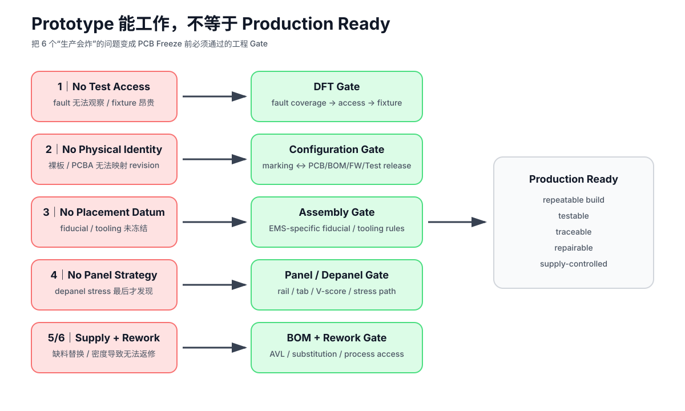

# 03｜DFT、Testpoint 与 Fixture：测试能力必须在 PCB 设计时购买

> 本章吸收 John Teel / Predictable Designs 的 *6 PCB Design Mistakes That Can Destroy Production* 中关于 testpoint / fixture 的部分。
>
> 核心不是“多放测试点”，而是把 **fault coverage、物理访问、fixture 成本和信号完整性** 一起设计。

## 3.1 DFT 是什么

Design for Testability 的目标不是“多放测试点”，而是让关键故障能够：

- 被激励；
- 被观察；
- 被定位；
- 被自动判定；
- 在合理 test cycle / fixture cost 下重复执行。

工作 prototype 只证明：

> **至少有一块板在某组条件下工作过。**

它没有自动证明：

- process variation 下仍工作；
- 每块板都能被快速测试；
- wrong part / open / short 能被定位；
- firmware programming 可被验证；
- production fixture 能稳定接触；
- 失败板能被经济地诊断与返修。

## 3.2 测试分层

### Bring-up Test

工程师调试用，允许示波器/飞线/手工操作。

### Production Test

目标是快、重复、低歧义。

### Diagnostic Test

当 production fail 时帮助定位返修。

三者测试点需求不同。

### Flying Probe / ICT / Boundary Scan / FCT

也不要混成一类。

它们可能分别更擅长：

- open/short / component-level electrical checks；
- node accessibility；
- digital interconnect coverage；
- final functional behavior。

是否需要某一种测试，取决于 volume、fault spectrum、cycle time、cost 和产品风险。

## 3.3 Testpoint Inventory

不要从“哪些 net 看起来重要”开始，而从：

~~~text
Production Fault
→ 需要什么 Stimulus
→ 需要观察什么 Node / Response
→ 什么 Access 最经济
→ 是否会扰动被测电路
~~~

对每个测试点记录：

| Net / Node | Fault covered | Purpose | Access | Expected | Instrument | Production? | Loading risk |
|---|---|---|---|---|---|---|---|
| 3V3 | open/rail fault | rail | pogo/probe | TBD | DMM | yes | low |
| GND | reference | return | pogo/probe | 0 V | fixture | yes | low |
| NRST | reset/program | control | pogo | digital | programmer | maybe | low |
| SWDIO/TCK | programming | FW load | fixture | protocol | programmer | yes | medium |
| UART | debug/diag | log | header/pogo | serial | fixture | maybe | medium |

### “所有关键 GPIO 都要测试点”不是课程铁律

视频建议为 power、ground、reset、communication bus、critical GPIO 提供访问，这是一条很好的 DFT 直觉。

课程改写成：

> **所有需要 production fault coverage 的节点，都必须有可实现的刺激/观察路径。**

这个路径可以是：

- dedicated test pad；
- connector pin；
- programming header；
- boundary scan；
- internal ADC / self-test；
- loopback；
- fixture-accessible component pad；
- alternate diagnostic path。

不是每个关键 net 都必须再加一个圆形 pad。

## 3.4 单面 Test Access：通常降低 Fixture 复杂度，但不是绝对要求

视频建议把 production testpoint 放在同一面，并优先放在元件背面，以避免 double-sided bed-of-nails。

这个思路应保留成：

> **如果单面 access 能满足 fault coverage，通常更利于简单、低成本、可维护的 fixture。**

但是否能做到取决于：

- board density；
- bottom components；
- connector height；
- fixture architecture；
- board support；
- RF shield / enclosure；
- ICT / FCT 分工。

双面 fixture 并不是“错误”，只是需要明确它带来的：

- mechanics；
- alignment；
- probe count；
- maintenance；
- cost；
- cycle-time

影响。

## 3.5 High-Speed / RF Test Access：不要让 Testpoint 本身变成 Fault

视频提醒不要随意给 RF / high-frequency nets 加 test pads，因为额外结构可能引入 parasitic loading。

课程把它升级成：

> **Test access 是 signal channel 的一部分。**

需要检查：

- pad stub；
- capacitance；
- via；
- connector / probe transition；
- reference continuity；
- impedance discontinuity；
- de-embedding / calibration；
- probe repeatability。

对于：

- RF；
- SerDes；
- fast clocks；
- precision analog；

可能更适合：

- controlled test connector；
- RF pad / launch；
- boundary scan；
- built-in self-test；
- loopback；
- dedicated coupon；

而不是“随手加圆形 TP”。

## 3.6 Pogo Fixture 约束

PCB 阶段就要考虑：

- pad size；
- pitch；
- probe travel；
- board support；
- datum；
- tooling / locating feature；
- connector height；
- bottom-side component conflict；
- ground / power current；
- programming interface；
- operator ergonomics；
- fixture wear / maintenance。

### Testpoint Grouping 与 Nearby Ground

视频建议：

- testpoint 尽量集中；
- 清楚标识；
- 为手动 probe 提供 nearby ground。

这些不是目的本身，而是为了：

- 缩短 fixture routing；
- 减少 probe head travel；
- 提高 debug repeatability；
- 降低 measurement loop；
- 缩短维修定位时间。

如果 grouping 会破坏 layout / return path / creepage / channel integrity，则应以电路完整性优先。

## 3.7 Boundary / Functional Test

并非每块板都需要 ICT。

根据产品量与复杂度选择：

- continuity/basic rail；
- functional test；
- boundary scan/JTAG；
- memory test；
- interface loopback；
- RF/SerDes production test；
- calibration。

## 3.8 Fault Coverage

测试计划写：

~~~text
fault
→ stimulus
→ observation
→ pass/fail limit
→ diagnostic resolution
→ access method
→ cycle-time impact
~~~

“LED 会亮”通常不是足够的 production coverage。

例如：

| Fault | Stimulus | Observation | Access | Result |
|---|---|---|---|---|
| 3V3 open | power on | 3V3 absent | rail TP | fail |
| MCU not programmed | programmer connect | ID/readback | SWD | fail |
| UART solder open | loopback command | no response | FCT connector | fail |
| wrong sensor value | functional stimulus | out-of-limit | firmware/FCT | fail |

## 3.9 Fixture Version

Fixture 自己也是工程产品：

- fixture hardware revision；
- firmware；
- script；
- limits；
- calibration；
- maintenance；
- pogo replacement；
- golden DUT / self-check。

测试失败时必须区分 DUT 与 fixture。

## 3.10 Production Test Access Plan

新增工程模板：

[production-test-access-plan.md](../projects/production-release/production-test-access-plan.md)

在 PCB layout freeze 前必须回答：

- 哪些 faults 要在板级拦截；
- 哪些由 AOI/X-ray/ICT/Flying Probe/FCT 拦截；
- 哪些节点需要物理 access；
- 哪些信号禁止随意增加 stub/pad；
- fixture 从哪一面接触；
- board 如何定位与支撑；
- test cycle / maintenance / traceability 怎么做。

## 3.11 供应商能力只是 Case，不是通用规则

例如 JLCPCB 当前公开资料显示其 SMT/FCT/fixture 与 tooling 规则会按服务类型变化，说明：

> **生产测试和治具必须在真实 EMS 流程上冻结。**

课程不会把某个供应商某一年的 pad size、tooling-hole 数量或 fixture 方式写成永久行业标准。

## 3.12 Gate

- [ ] production fault coverage 已定义
- [ ] programming / firmware verification 有路径
- [ ] power / ground / reset 等关键 production nodes 可观察
- [ ] fixture access side 已冻结
- [ ] high-speed/RF test loading 已 review
- [ ] board support / datum / tooling strategy 已定义
- [ ] fixture revision / calibration / maintenance 有 owner
- [ ] testpoint map 与 release revision 一致

## 参考资料

- John Teel / Predictable Designs, *6 PCB Design Mistakes That Can Destroy Production*: https://www.youtube.com/watch?v=bobx-cOQ50Y
- Predictable Designs 同名文章: https://predictabledesigns.com/6-pcb-design-mistakes-that-can-destroy-production/
- JLCPCB, *SMT Inspection and Testing Capabilities*: https://jlcpcb.com/help/article/smt-inspection-and-testing-capabilities

> 视频中的“测试点全部放同一面”“底面通常最好”“所有重要信号都加 testpoint”等，课程保留为 fixture 成本与可测试性的工程直觉，不作为跨 EMS、跨信号类型的固定 sign-off 条款。
