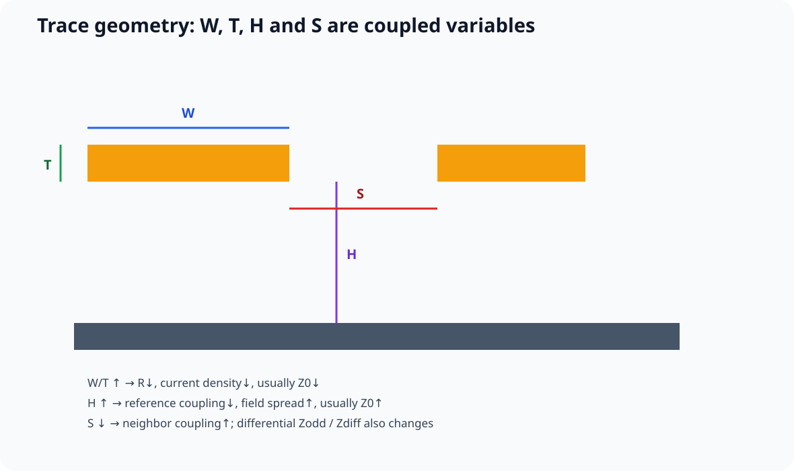

# 06｜Fabrication Package：板厂真正需要的是受控制造定义

## 6.1 最小输出

根据供应商能力，常见 fabrication package 包括：

- copper / mask / silkscreen fabrication data；
- drill；
- board outline；
- fabrication drawing / notes；
- stackup；
- impedance requirement；
- material / finish requirement；
- route / V-score information；
- netlist/verification data（如 IPC-D-356）；
- ODB++ / IPC-2581（如果双方流程支持）。

不要假设所有工厂都使用同一格式组合。

## 6.2 Gerber Review

独立 viewer 检查：

1. board outline；
2. 每层 copper；
3. soldermask；
4. silkscreen；
5. drill；
6. slot；
7. NPTH/PTH；
8. layer alignment。

## 6.2.1 看懂制造流程后，你就不会把 Core / Prepreg 当成“CAD 里的两种颜色”

EEVblog #939 的 PCB 制造流程非常适合放在 Stackup Freeze 之前看：内层成像、oxide、layup、press、drill、PTH、外层成像、soldermask，是一条连续制造链。

对多层课程最重要的是：

~~~text
Core：已经固化的铜箔层压板
Prepreg：压合时仍会流动、填充铜图形空隙的树脂/玻纤
~~~

这直接解释三个前面学过的现象：

1. 为什么 outer microstrip 常坐在 prepreg 上；
2. 为什么 residual copper ratio 会影响 pressed dielectric；
3. 为什么板厂必须用自己的 process data 做阻抗补偿。



### Fabrication Package 的意义因此也更清楚

你交付的不只是 Gerber 图形，而是在告诉板厂：

> **这组铜图形应该怎样被压成一个特定的电磁结构。**

所以 stackup note、material identity、finished copper、controlled impedance、CAM adjustment permission 都不是行政文档，而是设计的一部分。

### 视频来源

- EEVblog #939 — *How Is A PCB Manufactured?*  
  https://www.youtube.com/watch?v=rEB0pl8a5C0


## 6.3 Stackup Note

至少写：

```text
layer count
overall thickness
copper
material family
controlled impedance structures
target/tolerance
approved fab adjustment policy
coupon/TDR requirement
```

### 6.3.1 Material Identity 与 Substitution Control

“FR-4”不是足够完整的 reliability specification。

按产品需要冻结：

- approved laminate family / exact material；
- Tg；
- Td；
- Z-axis expansion / CTE；
- moisture behavior；
- CAF requirement；
- lead-free reflow compatibility；
- Dk / Df or controlled-impedance relevance；
- copper thickness / construction；
- applicable certification。

**Higher Tg 不是自动更可靠。**

材料选择必须回到具体 failure mechanism。

Fab substitute material 前应满足：

~~~text
property equivalence
→ impedance/process impact review
→ reliability impact review
→ approval / ECO when required
~~~

而不是由工厂在量产时静默换成“差不多的 FR-4”。

## 6.4 Drill Review

区分：

- plated；
- non-plated；
- slot；
- via；
- mechanical hole；
- special via process。

## 6.5 Fabrication Drawing

关键机械信息不要只藏在 CAD：

- dimensions；
- tolerances；
- datum；
- hole notes；
- finish；
- special edge / bevel；
- controlled depth / backdrill（如有）。

## 6.6 Netlist Cross-check

如生产流程支持，使用独立 netlist / electrical verification 数据帮助发现 CAM 处理或文件错误。

## 6.6.1 Controlled-Impedance Board 还需要“可验证结构”

如果一个项目声称 controlled impedance 是 release requirement，那么 fabrication package 不应只有 Gerber + 一句“90 Ω”。

Lee Ritchey 的 Design-for-Test 资料提出了一个很实用的制造验证思路：

- 每个受控阻抗层提供对应 test trace / coupon；
- single-ended 与 differential structure 分开；
- 用 stacking stripe / edge witness 检查层序、介质与 etch；
- 对 plane pair 需要时预留可测结构。

### 📐 一个最小 Coupon 思维图

~~~text
Panel edge
┌──────────────────────────────────────────┐
│  L1  SE coupon  ───────────────────────  │
│  L1  DIFF coupon ══════════════════════  │
│  L3  SE coupon  ───────────────────────  │
│  L3  DIFF coupon ══════════════════════  │
│                                          │
│  stacking stripes  ||||||||||||||        │
└──────────────────────────────────────────┘
~~~

这里的目标不是让每个 hobby prototype 都做复杂 IPC coupon，而是训练一个重要思维：

> **如果某个制造参数真的重要，就应该问“我如何证明它制造对了？”**

### Fabrication Drawing 新增阻抗表

| Net class / structure | Layer | Reference | W | S/G | Target Z | Tolerance | Coupon | Fab may adjust? |
|---|---|---|---:|---:|---:|---:|---|---|
| USB_DIFF | | | | | | | | |
| CLK_SE | | | | | | | | |

### “板厂会测”要具体到测试等级

资料集中记录的 JLCPCB laminated-structure 文档区分不同阻抗测试/精度服务。课程不把某个当前百分比写成永久规则，而要求 release package 明确：

- 订单选择的 impedance service；
- acceptance tolerance；
- coupon 是否由 fab 生成还是设计者提供；
- 是否要 TDR report；
- CAM 调线宽是否允许；
- report 是否作为 lot evidence 归档。

### Stacking Stripe 为什么值钱？

阻抗 fail 有时不是线宽问题，而是：

~~~text
layer order swapped
dielectric thickness wrong
wrong material
etch bias
wrong copper
~~~

这些错误在成品板上可能表现成“所有高速网络都怪怪的”。

stacking stripe / witness structure 的价值，就是在装配前给你一个低成本的物理证据。

### 来源

- Lee Ritchey, *PCB Design For Test — Test Structures And Types Of Tests, Part 1*  
  https://resources.altium.com/p/pcb-design-test-test-structures-and-types-tests-part-1
- JLCPCB, *Multi-Layer PCB Standard Laminated Structures*  
  https://jlcpcb.com/help/article/multi-layer-pcb-standard-laminated-structures
- Zachariah Peterson, *Impedance Control: How to Specify Your Requirements for PCB Manufacturers*  
  https://resources.altium.com/p/pcb-manufacturing-and-impedance-control-how-specify-your-requirements


## 6.6.2 Finished Geometry Ownership：Gerber 里的线宽到底是谁负责？

受控阻抗交付里最容易发生的一类沟通事故是：

~~~text
Designer 以为：Fab 会帮我自动把线宽调到目标阻抗
Fab 以为：Gerber 里的宽度就是你要的 finished width
~~~

Lee Ritchey 的制造建议强调：设计输出应该明确 **finished geometry**，板厂为了补偿 etch 可以调整其 working film / CAM 数据，但不能靠双方默契猜测。

### 课程要求：每个 controlled-impedance profile 都写清四件事

| 项目 | 必须明确 |
|---|---|
| Target Z | 例如 50 Ω / 90 Ω / 100 Ω |
| Design geometry | Gerber 中的 W / S / G |
| Finished geometry ownership | 设计者冻结，还是允许 fab 调整 |
| Acceptance evidence | coupon / TDR / CAM report / lot record |

### 两种可接受的协作方式

#### A. Designer-owned geometry

~~~text
stackup frozen
→ designer solver
→ Gerber width = intended finished width
→ fab only applies process compensation internally
~~~

#### B. Fab-tuned controlled impedance

~~~text
designer supplies target + starting geometry
→ fab uses its real laminate / etch model
→ fab adjusts permitted geometry
→ coupon / TDR confirms result
~~~

这两种都可以，但**不能混在一起**。

### 还有一个经常被忽略的证据：Stacking Stripe

Ritchey 推荐在 panel 边缘保留 stacking stripe / witness structure，用来验证：

- layer order；
- dielectric thickness；
- etch bias；
- 某些情况下的错误压合。

它的价值在于：如果整块高速板都表现异常，可以先排除“层序压错 / 介质做错”这类系统性制造错误，而不是直接怀疑所有 SI 仿真。

### 来源

- Lee Ritchey, *Everything You Need for Successful PCB Stackup Design*  
  https://resources.altium.com/p/everything-you-need-successful-pcb-stackup-design
- Lee Ritchey, *PCB Design For Test — Test Structures And Types Of Tests, Part 1*  
  https://resources.altium.com/p/pcb-design-test-test-structures-and-types-tests-part-1
- Zachariah Peterson, *Impedance Control: How to Specify Your Requirements for PCB Manufacturers*  
  https://resources.altium.com/p/pcb-manufacturing-and-impedance-control-how-specify-your-requirements


## 6.7 Release Gate

- [ ] 从冻结 commit 生成；
- [ ] Jobset / CLI 可重复；
- [ ] Gerber viewer 已人工复核；
- [ ] stackup 与 fab 已确认；
- [ ] drill / slots 已确认；
- [ ] package hash / manifest 已生成。
