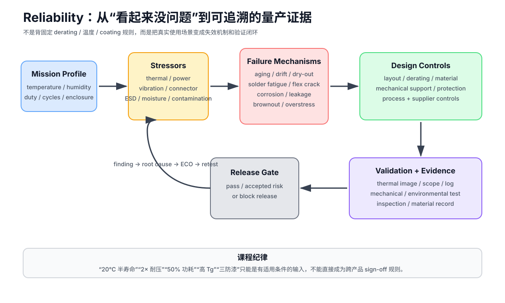

# 10｜Reliability 与 Pre-compliance：一次上电成功不代表产品会稳定工作

> 本章吸收 John Teel / Predictable Designs 的 *10 PCB Design Mistakes That Damage Product Reliability*。
>
> 原视频用 10 个常见失误建立产品化直觉：thermal、power、derating、solder joint、environment、connector/mechanical、battery、vibration、capacitor choice、PCB material。
>
> 课程保留这个框架，但不把其中的经验数字直接升级成跨产品规则。真正的可靠性流程是：
>
> **Mission Profile → Stress → Failure Mechanism → Design Control → Validation → Evidence → Release Decision**

---

## 10.1 Reliability 从使用场景开始

先定义：

- temperature / temperature cycle；
- humidity / condensation；
- dust / contamination；
- vibration / shock / drop；
- power cycles；
- connector mate cycles；
- ESD/EFT/surge exposure；
- duty cycle；
- battery state / charging profile；
- enclosure / airflow；
- expected lifetime；
- maintenance / service model。

没有 mission profile，就没有“可靠性够不够”的统一答案。

同一个 PCB：

- 放在开放实验台；
- 放进无风塑料壳；
- 装进汽车；
- 装到室外设备；

其可靠性要求完全不同。

---

## 10.2 HALT/HASS 与常规验证要区分

不同产品会使用不同加速或筛选方法。本课程只要求建立：

> **应力 → 失效机制 → 测试 → 判据 → 证据**

而不是背某套固定温度、小时数或循环次数。

必须区分：

- qualification / design validation；
- reliability growth；
- HALT；
- HASS / production screening；
- compliance / pre-compliance；
- field monitoring。

这些活动回答的问题并不相同。

---

## 10.3 视频的 10 个可靠性错误，课程怎么吸收

| 视频主题 | 真正风险 | 课程落地 |
|---|---|---|
| 1. Thermal mismanagement | aging、drift、solder fatigue、thermal runaway | mission-profile thermal validation |
| 2. Inadequate power supply | startup/brownout/transient/thermal margin | Part 3 PI + worst-case load validation |
| 3. Poor derating | overstress、drift、reduced life | requirement-based derating matrix |
| 4. Weak solder joints | fatigue、void、crack、pad damage | DFA + process capability + inspection |
| 5. Environment ignored | corrosion、leakage、ESD、contamination | environment-specific protection |
| 6. Connector/mechanical weakness | solder crack、PCB flex、user-force damage | load path + strain relief + cycle test |
| 7. Battery protection missing | safety、shutdown、swelling/fire | battery architecture + safety evidence |
| 8. Vibration/mechanical stress | cracked joints/traces/BGA damage | mounting + stiffness + mechanical test |
| 9. Wrong capacitor assumptions | DC-bias loss、ESR/ESL、lifetime/ripple issues | exact-MPN capacitor review |
| 10. Marginal PCB material | delamination、moisture、CAF、Z-axis expansion、loss drift | material identity + fab substitution control |

这 10 条不是 10 个彼此独立的 checklist item。

真实产品更像：

~~~text
high ambient
→ regulator hotter
→ capacitor hotter
→ ESR/lifetime changes
→ rail transient worsens
→ reset margin decreases
~~~

或者：

~~~text
connector user force
→ board flex
→ solder joint stress
→ intermittent contact
→ ESD current path changes
→ field failure
~~~

可靠性必须看**耦合失效链**。

---

## 10.4 Mistake 1：Thermal Mismanagement

视频强调：

- bench 上“只是温热”不代表 enclosure 内长期可靠；
- 满载、封闭壳体、无 airflow 时可能出现完全不同的温度；
- thermal camera 比手摸更有证据价值。

这些方向是正确的。

### 但“温度每升 20°C，寿命减半”不能写成通用定律

不同失效机制遵循不同加速模型。

可能涉及：

- semiconductor wear-out；
- electrolytic dry-out；
- solder fatigue；
- diffusion；
- polymer aging；
- battery aging。

其 activation energy、temperature range、cycle amplitude、dwell time 都不同。

课程因此只保留：

> **升温通常会加速很多老化机制，但具体寿命倍率必须绑定器件模型、材料数据或验证证据。**

### Thermal Review 必须记录

| Item | Evidence |
|---|---|
| ambient min/max | requirement |
| enclosure state | closed/open, airflow |
| workload | idle / nominal / worst-case |
| duty cycle | mission profile |
| hotspot | thermal image / sensor |
| junction estimate | datasheet/model |
| component rating | exact MPN |
| margin | requirement-based |
| soak duration | validation plan |

### Layout 动作也不能机械化

“hot part 分开”“加大 copper pour”“加 thermal via”通常有帮助，但必须结合：

- regulator topology；
- exposed pad requirement；
- copper spreading；
- airflow；
- enclosure conduction path；
- temperature-sensitive parts；
- creepage/clearance；
- RF/analog isolation。

不是“看到热器件就无限铺铜”。

---

## 10.5 Mistake 2：Inadequate Power Supply Design

视频提醒不要只看 regulator 的 current rating。

量产可靠性至少同时检查：

- continuous load；
- peak / pulse load；
- startup / simultaneous startup；
- inrush；
- low battery / low input；
- high input；
- transient load；
- regulator thermal limit；
- current limit；
- dropout；
- loop stability；
- output capacitor requirement；
- brownout / reset behavior。

典型 field symptom：

~~~text
Wi-Fi TX / display backlight / motor start
→ load step
→ rail droop
→ BOR / reset
→ “偶发软件 bug”
~~~

因此 Power Reliability Gate 应复用 Part 3：

- DC PI；
- transient response；
- PDN impedance；
- startup；
- thermal；
- measurement。

### 一个重要纠偏

视频说“在所有 active IC 附近混合高低值电容”。

课程不把它写成固定做法。

正确顺序是：

~~~text
IC / regulator requirement
→ load spectrum
→ exact capacitor model
→ DC bias / ESR / ESL
→ mounting inductance
→ stability / impedance
→ measured result
~~~

不是先按“100 nF + 1 µF + 10 µF”机械收集电容值。

---

## 10.6 Mistake 3：Poor Component Derating

视频给出：

- capacitor voltage rating 至少 2× applied voltage；
- resistor power 至少 2× dissipation；

作为简单经验。

### 课程不把 2× / 50% 设为固定门槛

原因是 derating 取决于：

- component technology；
- temperature；
- voltage/current waveform；
- surge；
- ripple；
- altitude；
- cooling；
- expected life；
- vendor derating curve；
- safety/industry requirement；
- consequences of failure。

例如：

- MLCC 更关注 DC bias、mechanical cracking 与 voltage stress；
- electrolytic 还要看 ripple current、core temperature、rated life；
- MOSFET 需要看 SOA、switching loss、avalanche、junction temperature；
- resistor 需要看 ambient derating curve、pulse energy、working voltage。

### 推荐的 Derating Matrix

| Part | Stress | Actual | Rating/curve | Margin | Source | Worst case |
|---|---|---:|---:|---:|---|---|
| Cxx | voltage | | | | datasheet | startup |
| Cyy | ripple current | | | | datasheet | max load |
| Rxx | power | | | | datasheet | fault/nominal |
| Qxx | VDS/ID/SOA | | | | datasheet | switching |
| Uxx | Tj | | | | datasheet | sealed enclosure |

原则：

> **Derating 是“实际应力相对允许应力”的工程证据，不是统一百分比。**

---

## 10.7 Mistake 4：Weak Solder Joint Reliability

Solder joint 同时承担：

- electrical connection；
- mechanical load；
- thermal cycling strain。

所以 DRC 通过并不能证明 solder joint 可靠。

### 常见风险

- pad geometry 不合理；
- paste / stencil 不合适；
- reflow profile 不匹配；
- large thermal mass 造成温度不均；
- via-in-pad solder wicking；
- connector user force；
- board flex；
- heavy/tall component inertia；
- repeated thermal cycle。

### Thermal Relief 不是万能可靠性开关

视频强调 thermal relief 可改善某些 plane-connected through-hole / SMT pad 的可焊性。

课程改写成：

> **是否使用 thermal relief，取决于电流、热路径、焊接工艺与 joint quality。**

例如：

- 大电流 pad；
- exposed thermal pad；
- power module；
- press-fit；
- RF ground pad；

可能需要与“普通 thermal relief”不同的处理。

### Via-in-Pad 也不是禁止项

风险来自：

> **未定义工艺的 via-in-pad**

而不是 via-in-pad 本身。

如果使用，应明确：

- via type；
- fill；
- cap / planarization；
- plating；
- soldermask；
- supplier capability；
- assembly feedback。

详见 Part 9 / 02 DFM/DFA。

---

## 10.8 Mistake 5：Ignoring Environmental Protection

环境风险至少包括：

- humidity；
- condensation；
- liquid ingress；
- dust；
- ionic contamination；
- salt / corrosive atmosphere；
- insects / debris；
- ESD；
- high-voltage creepage/clearance stress。

### Conformal Coating 不是“有湿度就涂”

视频把 coating 作为 moisture/humidity 的常见保护方向。

课程必须再加一层：

使用 coating 前要定义：

- contamination cleanliness；
- coating chemistry；
- coverage；
- keepout/masking；
- connector/testpoint handling；
- cure；
- inspection；
- rework；
- compatibility with plastics/adhesives；
- high-voltage behavior。

不正确的 coating 可能把污染物封在下面，或者让后续维修和检测更困难。

所以：

> **是否 coating 由 environment + failure mechanism + process capability 决定。**

高压 creepage/clearance 仍应依据适用安全标准和污染等级等条件，不能因为有 coating 就随意缩小。

---

## 10.9 Mistake 6：Poor Connector and Mechanical Design

Connector 是电气件，也是用户施力点。

设计时必须画出：

~~~text
user / cable force
→ connector shell / anchor
→ PCB
→ mounting hole / enclosure
→ chassis
~~~

如果这个 load path 最后只能经过 SMT solder fillet，可靠性通常很脆弱。

### Review 项

- mechanical anchor tabs；
- mounting-hole proximity；
- enclosure support；
- cable strain relief；
- repeated mate/unmate；
- insertion/extraction force；
- cable torque；
- drop direction；
- board-edge leverage；
- connector alignment tolerance。

USB-C 本身并不自动保证产品可靠。

真正决定结果的是：

> **specific receptacle + footprint + anchor + board thickness + enclosure support + use cycle。**

---

## 10.10 Mistake 7：Battery Without Proper Protection

这一项已在课程单独展开。

至少检查：

- overcharge；
- over-discharge；
- overcurrent / short；
- thermal behavior；
- charger fault；
- protection action；
- pack qualification；
- mechanical damage；
- transport / compliance evidence；
- exact pack/cell traceability。

不能把：

> “battery pack 自带保护”

当成无需验证的黑盒结论。

详见：

[Part 1｜电池供电产品](../11_Part1_STM32F407四层板/10_电池供电产品_选型安全认证与可维修性.md)

---

## 10.11 Mistake 8：Ignoring Vibration and Mechanical Stress

PCB 不是刚体。

风险包括：

- board bending；
- mounting preload；
- depanel stress；
- connector insertion；
- drop；
- vibration；
- tall-component rocking；
- cable pull；
- enclosure twist。

这些应力可能造成：

- BGA / QFN joint cracking；
- MLCC flex cracking；
- pad lift；
- via/barrel fatigue；
- copper trace fracture；
- intermittent connector fault。

### 设计动作

根据 mission profile 选择：

- mounting hole / standoff；
- stiffener；
- board thickness；
- component placement；
- adhesive / mechanical support；
- connector anchoring；
- depanel strategy；
- flexible cable section；
- keepout around high-strain zone。

### 测试动作

不要只写“做 vibration”。

测试计划至少定义：

- axis；
- fixture；
- board mounting state；
- powered/unpowered；
- functional monitoring；
- acceptance criterion；
- post-test inspection。

---

## 10.12 Mistake 9：Using the Wrong Capacitor Assumptions

视频的核心方向值得保留：

> **同样写 capacitor，并不代表在目标频率、偏置、温度和寿命下表现相同。**

但“electrolytic = bulk、ceramic = high-frequency”只能作为第一层直觉。

真实 review 要看：

### MLCC

- dielectric class；
- DC bias；
- AC bias；
- temperature；
- package；
- flex-crack risk；
- ESR/ESL；
- exact MPN model。

### Electrolytic / Polymer

- rated life；
- core temperature；
- ripple current；
- ESR；
- dry-out / aging；
- surge；
- venting；
- mounting orientation / thermal environment。

### Tantalum

- surge/current behavior；
- voltage derating policy；
- failure consequence；
- exact technology/vendor guidance。

因此：

> **电容类型不是按“用途标签”选，而是按 impedance + energy + lifetime + mechanical + fault behavior 共同选。**

Part 3 已覆盖 DC bias、SRF、ESR/ESL、anti-resonance，本章不重复理论。

---

## 10.13 Mistake 10：Marginal PCB Materials

“FR-4”不是一个足够完整的生产材料定义。

真正影响可靠性的属性可能包括：

- Tg；
- Td；
- Z-axis CTE / expansion；
- moisture absorption；
- CAF resistance；
- decomposition / delamination behavior；
- copper adhesion；
- dielectric loss / Dk stability；
- thickness/copper tolerance；
- flame rating / certification；
- lead-free reflow compatibility。

### 一个重要纠偏：Higher Tg 不等于 Automatically More Reliable

高 Tg 可能有助于某些 thermal/process margin，但不能单独代表：

- 低 moisture；
- 低 Z-expansion；
- 好 CAF；
- 好 RF loss；
- 更好的 copper adhesion；
- 更稳定的 impedance。

所以 release package 不应该只写：

~~~text
FR-4, high Tg
~~~

而要写清：

- approved material family / exact laminate when required；
- key property requirements；
- allowed equivalent/substitution policy；
- fab must notify before substitution。

详见 Part 9 / 06 Fabrication Package。

---

## 10.14 Protection Validation：从“器件存在”升级成“故障可恢复”

量产 release 前，保护器件不能只在 BOM 里“存在”。

至少形成：

| Threat | Trigger | Expected protection | Safe state | Recovery | Evidence |
|---|---|---|---|---|---|
| overload | controlled current fault | fuse/eFuse/current limit | no thermal damage | defined | test log |
| hot-plug | repeated plug-in | inrush control | source remains stable | automatic | scope |
| brownout | rail ramp/droop | reset/BOR/supervisor | outputs safe | reboot | log |
| firmware lockup | forced hang | watchdog | outputs safe | reboot | log |
| external ESD | pre-compliance | TVS/current steering | no permanent damage | defined criterion | report |

保护验证的毕业标准不是：

> “故障后还能重新上电。”

而是：

> **fault detection、safe state、recovery 和 evidence 都被定义。**

基础架构见：[Part 1｜09 产品级保护电路](../11_Part1_STM32F407四层板/09_产品级保护电路_从接口到SafeState.md)。

---

## 10.15 Battery Reliability 需要独立 Mission Profile

Battery-powered product 额外记录：

- ambient / cell temperature；
- charge temperature；
- pulse-current profile；
- depth of discharge；
- charge cycles；
- storage duration / SoC；
- mechanical shock / swelling；
- connector / holder cycles；
- charger fault；
- pack protection event；
- battery replacement event。

验证重点：

~~~text
new battery
aged battery
cold battery
low-SoC battery
worst pulse load
~~~

都必须满足 system rail / BOR / safe-state requirement。

对 lithium product，还要把：

> **transport evidence + safety report + exact MPN traceability**

作为 production release evidence，而不是采购附件。

---

## 10.16 EMC Pre-compliance

复用 Part 4：

- source inventory；
- cable experiment；
- near-field；
- conducted path；
- ESD/EFT/surge preparation；
- reproducible configuration。

特别注意：

> ESD 后“还能工作”不一定代表没有 latent damage。

是否允许性能降级、自动恢复、人工重启或永久 fault，必须在产品 requirement 中定义。

---

## 10.17 Reliability Validation Matrix

不要写：

> “做过高温、振动、ESD，所以可靠。”

要写成：

| Requirement | Stress | Failure mechanism | Configuration | Acceptance | Evidence |
|---|---|---|---|---|---|
| no reset at worst load | low Vin + load step | rail droop | sealed enclosure | no BOR | scope/log |
| connector life | mate cycles + side load | solder/anchor fatigue | production mech | no intermittent | test log |
| thermal margin | max ambient + workload | over-temp aging | closed enclosure | below defined limit | thermal report |
| environment | humidity/condensation profile | corrosion/leakage | coated/uncoated config | pass criterion | report |

模板：

[reliability-validation-matrix.md](../projects/production-release/reliability-validation-matrix.md)

---

## 10.18 Reliability Finding

每条 finding 记录：

~~~text
stress
mission-profile link
symptom
reproduction
failure mechanism
root cause
fix
side effect
retest
ECO
evidence
~~~

这会把“可靠性问题”从经验讨论变成可追溯工程闭环。

---

## 10.19 进入量产前

所有 blocker / major reliability issue 必须：

- close；
- accept with documented rationale；
- or explicitly gate release。

Release Review 至少回答：

- [ ] Mission Profile 已冻结
- [ ] thermal worst case 有实测/模型证据
- [ ] power startup / load transient / low-input 已验证
- [ ] critical-part derating 有 exact-MPN 证据
- [ ] solder / connector / mechanical load path 已 review
- [ ] vibration/drop/board-flex 风险有对应验证
- [ ] environment / coating / creepage-clearance 策略有依据
- [ ] battery protection/qualification 可追溯
- [ ] capacitor DC-bias/lifetime/ripple/ESR-ESL 有依据
- [ ] laminate/material identity 与 substitution policy 已冻结
- [ ] reliability finding 已闭环到 ECO / release evidence

---

## 参考资料

- John Teel / Predictable Designs, *10 PCB Design Mistakes That Damage Product Reliability*: https://www.youtube.com/watch?v=Hb6XQtbHSM8
- Predictable Designs 同名文章（2026-01-16）
- 本课程 Part 3：Power Integrity / capacitor / thermal
- 本课程 Part 4：ESD / EMC / external interface
- 本课程 Part 9：DFM / DFA / BOM / Fabrication / Release

> 视频中的“20°C 寿命减半”“电容 2× 耐压”“电阻 50% 功耗”“有湿气就 conformal coating”“优先 higher-Tg FR-4”等，均作为作者的经验性教学建议记录。课程不会把这些数字或结论直接升级成跨器件、跨行业、跨 mission profile 的固定 sign-off 规则。
